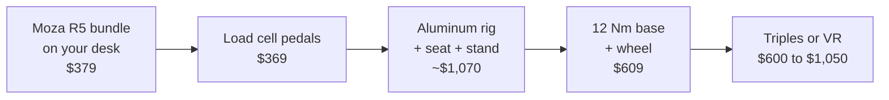

# Types of Setups

<!-- Draft for you to edit. Facts from research-v2/05-tier-builds-used-market.md (sources there). Prices USD, listings checked 2026-10-09. -->

## The six tiers

| Tier | Cost | Mount | Wheel | Brake | Screen | Example build |
|---|---|---|---|---|---|---|
| [0: Desk Starter](tier-0-desk-starter.md) | $200 to $400 | Desk clamp | 2 to 6 Nm | Spring | Yours | [$379](tier-0-desk-starter.md#example-build) |
| [1: Foldable / Apartment](tier-1-foldable-apartment.md) | $500 to $700 | Folding seat or stand | 4 to 6 Nm direct drive | Spring | Yours | [$678](tier-1-foldable-apartment.md#example-build) |
| [2: First Dedicated Rig](tier-2-first-dedicated-rig.md) | $1,200 to $1,600 | Steel cockpit or budget profile | 8 to 9 Nm | Entry load cell | Yours | [$1,058](tier-2-first-dedicated-rig.md#example-build) |
| [3: Sweet Spot Enthusiast](tier-3-sweet-spot-enthusiast.md) | $1,800 to $2,200 | Aluminum profile | 12 Nm | Good load cell | Yours | [$2,045](tier-3-sweet-spot-enthusiast.md#example-build) |
| [4: Triples / VR Enthusiast](tier-4-triples-vr-enthusiast.md) | $3,500 to $5,500 | Aluminum profile | 12 to 21 Nm | Good load cell | Triples or VR | [$3,566](tier-4-triples-vr-enthusiast.md#example-build) |
| [5: Motion / Pro](tier-5-motion-pro.md) | $10,000 to $18,000 | Profile on motion actuators | 25 Nm | Active | Triples or VR | [$14,177](tier-5-motion-pro.md#example-build) |

- Each tier page ends with a full example build: every part, price and a link to buy it

## Basic constraints

| Constraint | What it means |
|---|---|
| PC | Everything works, every game |
| Xbox | Moza R3, Fanatec with an Xbox wheel, Logitech, Thrustmaster |
| PlayStation | Only Logitech, Thrustmaster, Fanatec GT DD Pro and ClubSport DD+. Costs more at every tier |
| Any console | One screen, no triples, no iRacing. VR only on PlayStation (PS VR2, Gran Turismo 7) |
| Desk only | Tier 0 |
| Must fold away | Tier 1. Folded ~104×93×30 cm |
| Permanent spot | ~2.0×1.0 m for a rig and a single screen |
| Triples | ~1.8 to 2.1 m wide |
| Neighbors and housemates | Gear wheels rattle, direct drive is quiet. Bass shakers and motion travel through floors |
| Time | Tier 0 and 1 need setup every session. Friction kills the habit. A permanent rig gets used more |

## PC power

| Screen | PC needed |
|---|---|
| Single 1440p | ~$1,150 PC |
| Ultrawide, entry triples, Quest VR | ~$1,850 to $2,200 PC |
| Triple 1440p, most VR | ~$3,200 PC |
| Pimax Dream Air class VR | More. RTX 4090 / 5090 |

## What each jump buys

| Jump | You get |
|---|---|
| 0 to 1 | Pedals and seat stop moving |
| 1 to 2 | Nothing flexes, brake by pressure. Consistency |
| 2 to 3 | A rig and pedals you never replace |
| 3 to 4 | You can see beside you. Immersion |
| 4 to 5 | The rig moves. Feel, not speed |

## Cheapest path through the tiers

- Total ~$3,000 to $3,500
- Order: direct drive first, load cell brake second, then everything else
- Load cell before the rig: brake set light, chair blocked, pedals against a wall
- The 12 Nm base is optional. 5 to 8 Nm lasts years
- Lost on outgrown parts: ~$150 to $250 (est)
- vs G29, then foldable, then steel cockpit: ~$500 to $900 lost (est)
- Skip Tier 1 unless it truly must fold away
- Skip the Tier 2 steel cockpit if the floor space exists
- PlayStation: no cheap direct drive first step. Used G29, or straight to a Logitech RS50 or Fanatec GT DD Pro

## Related pages

- [Tier 0: Desk Starter](tier-0-desk-starter.md)
- [Tier 1: Foldable / Apartment](tier-1-foldable-apartment.md)
- [Tier 2: First Dedicated Rig](tier-2-first-dedicated-rig.md)
- [Tier 3: Sweet Spot Enthusiast](tier-3-sweet-spot-enthusiast.md)
- [Tier 4: Triples / VR Enthusiast](tier-4-triples-vr-enthusiast.md)
- [Tier 5: Motion / Pro](tier-5-motion-pro.md)
- [Buying Smart](../start/buying.md)
