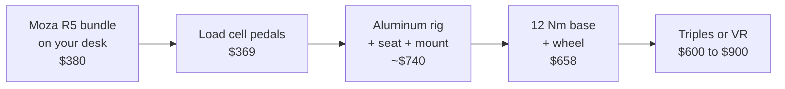

# Types of Setups

<!-- Draft for you to edit. Facts from research-v2/05-tier-builds-used-market.md (sources there). Prices USD, checked 2026-10. -->

## The six tiers

| Tier | Cost | Mount | Wheel | Brake | Screen |
|---|---|---|---|---|---|
| [0: Desk Starter](tier-0-desk-starter.md) | $200 to $400 | Desk clamp | 2 to 5.5 Nm | Spring | Yours |
| [1: Foldable / Apartment](tier-1-foldable-apartment.md) | $500 to $700 | Folding seat or stand | 4 to 5.5 Nm direct drive | Spring | Yours |
| [2: First Dedicated Rig](tier-2-first-dedicated-rig.md) | $1,200 to $1,600 | Steel cockpit or budget profile | 8 to 9 Nm | Entry load cell | Yours |
| [3: Sweet Spot Enthusiast](tier-3-sweet-spot-enthusiast.md) | $1,800 to $2,200 | Aluminum profile | 12 Nm | Good load cell | Yours |
| [4: Triples / VR Enthusiast](tier-4-triples-vr-enthusiast.md) | $3,500 to $5,500 | Aluminum profile | 12 to 21 Nm | Good load cell | Triples or VR |
| [5: Motion / Pro](tier-5-motion-pro.md) | $10,000 to $18,000 | Profile on motion actuators | 25 Nm | Active | Triples or VR |

## Basic constraints

- Platform
    - PC: everything works, every game
    - Xbox: Moza R3, Fanatec with an Xbox wheel, Logitech, Thrustmaster
    - PlayStation: only Logitech, Thrustmaster, Fanatec GT DD Pro and ClubSport DD+. Costs more at every tier
    - Console: one screen, no triples, no iRacing. VR only on PlayStation (PS VR2, Gran Turismo 7)
- Space
    - Desk only: Tier 0
    - Must fold away: Tier 1. Folded ~104×93×30 cm
    - Permanent: ~2.0×1.0 m for a rig and single screen
    - Triples: ~1.8 to 2.1 m wide
- Neighbors and housemates
    - Gear wheels rattle. Direct drive is quiet
    - Bass shakers and motion travel through floors
- PC power
    - Single 1440p screen: ~$1,150 PC
    - Ultrawide, entry triples, Quest VR: ~$1,850 to $2,200 PC
    - Triple 1440p, most VR: ~$3,200 PC. Pimax Dream Air class: more
- Time
    - Tier 0 and 1 need setup every session. Friction kills the habit
    - A permanent rig gets used more

## What each jump buys

- 0 to 1: pedals and seat stop moving
- 1 to 2: nothing flexes, brake by pressure. Consistency
- 2 to 3: a rig and pedals you never replace
- 3 to 4: you can see beside you. Immersion
- 4 to 5: the seat moves. Feel, not speed

## Cheapest path through the tiers

- Total ~$2,750 to $3,050
- Order: direct drive first, load cell brake second, then everything else
- Load cell before the rig: brake set light, chair blocked, pedals against a wall
- The 12 Nm base is optional. 5 to 8 Nm lasts years
- Lost on outgrown parts: ~$150 to $250 (est)
- vs G29, then foldable, then steel cockpit: ~$500 to $900 lost (est)
- Skip Tier 1 unless it truly must fold away
- Skip the Tier 2 steel cockpit if the floor space exists
- PlayStation: no cheap direct drive first step. Used G29, or straight to a Logitech RS50 or Fanatec GT DD Pro

## Related pages

- [Tier 0: Desk Starter](tier-0-desk-starter.md)
- [Tier 1: Foldable / Apartment](tier-1-foldable-apartment.md)
- [Tier 2: First Dedicated Rig](tier-2-first-dedicated-rig.md)
- [Tier 3: Sweet Spot Enthusiast](tier-3-sweet-spot-enthusiast.md)
- [Tier 4: Triples / VR Enthusiast](tier-4-triples-vr-enthusiast.md)
- [Tier 5: Motion / Pro](tier-5-motion-pro.md)
- [Buying Smart](../start/buying.md)
