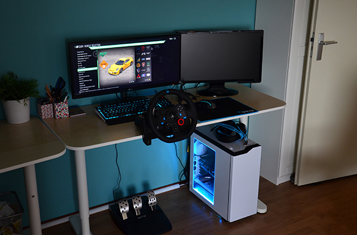

# Tier 0: Desk Starter

<!-- Image source: https://www.techtesters.eu/logitech-g29-driving-force-shifter/5/ -->

<!-- Placeholder, write this page in your own voice. Research for this topic lives in the repo under research/ (not published on this site). -->

## Cost

### $200–$400

<small>Assumes: existing PC/console, display, desk</small>

## Target user

- Curious after F1 Arcade, want to try a wheel at home for minimum money

## Parts

- Logitech G923 bundle: wheel + rim + 3 pedals, gear drive ~2.3 Nm
- Desk clamp (in box) + pedal stop: wall or shoebox
- Alt: Moza R3 3.9 Nm DD $279–339 (PC/Xbox, no PS) / Thrustmaster T248 $240–400 / T128 $200

## Footprint

- Existing desk ~120×60 cm, wheel clamps to edge
- Pedals on floor against wall or box

## What it feels like

- Grainier FFB than F1 Arcade, no motion
- Unlimited seat time
- Slower than controller for the first week

## Pros / cons

- \+: cheapest way in, nothing to build or store
- −: pedals slide, desk flex, no load-cell pedals yet

## Next upgrade

- Tier 1 foldable or wheel stand

## Used-market alternative

- G29/G920 ~$150–200; check pot jitter + gear slack
- Avoid G27 (no PS5/Xbox)

## Related pages

- [Tier 1: Foldable / Apartment](tier-1-foldable-apartment.md)
