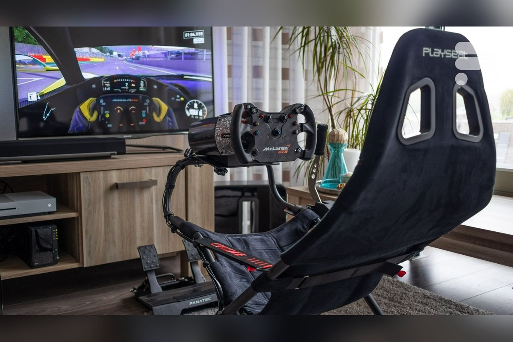

# Tier 1: Foldable / Apartment

<!-- Image source: https://www.shango.media/frandroid-quels-sont-les-meilleurs-volants-pour-ps5-xbox-et-pc-en -->

<!-- Placeholder, write this page in your own voice. Research for this topic lives in the repo under research/ (not published on this site). -->

## Cost

### $500–$700

<small>Assumes: existing PC/console, display, foldable space</small>

## Target user

- Hooked after Tier 0, or sure you'll stick with it
- Apartment / shared room, rig must disappear

## Parts

- Moza R5 bundle: 5.5 Nm direct drive, ES rim, 2-pedal Hall set, $379 sale
- Playseat Challenge X: foldable, carbon steel, $299
- Console: G923 $350 (PS/Xbox); PS direct drive: Thrustmaster T598 5 Nm $466–500
- Alt: NLR Wheel Stand 2.0 $279 (use your chair)

## Footprint

- Challenge X in use: 140×60×105 cm, 11.1 kg
- Folds with wheel attached
- Wheel stand option: ~100×60 cm + own chair

## What it feels like

- First real seating position
- Direct drive FFB, big step up from gear/belt
- Wheel deck flex visible above ~8 Nm

## Pros / cons

- \+: folds away, proper position, DD wheel
- −: still flex, no load-cell brake yet

## Next upgrade

- Keep the R5, move to fixed Tier 2 rig
- Add SR-P2 load-cell pedals ($149) once hard-mounted

## Used-market alternative

- Original Playseat Challenge ~$120–180; check straps + plastic wheel-deck clamp

## Related pages

- [Tier 0: Desk Starter](tier-0-desk-starter.md)
- [Tier 2: First Dedicated Rig](tier-2-first-dedicated-rig.md)
