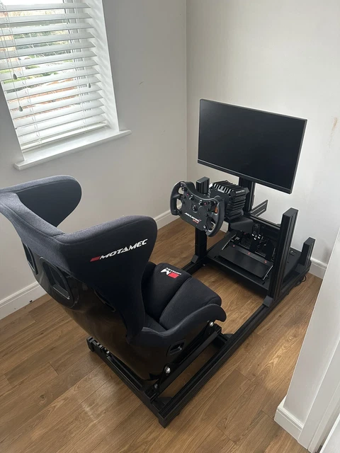

# Tier 2: First Dedicated Rig

<!-- Image source: https://picmasa.com/post/537568529EBEC3AE1A3445CD4EA74ECEDB90287B/E7F6F698314E1F60D2836FDB -->

<!-- Placeholder, write this page in your own voice. Research for this topic lives in the repo under research/ (not published on this site). -->

## Cost

### $1,200–$1,600

<small>Assumes: existing PC/console, display, dedicated space</small>

## Target user

<!-- TODO -->

## Parts

<!-- TODO -->

## Footprint

<!-- TODO -->

## What it feels like

<!-- TODO -->

## Pros / cons

<!-- TODO -->

## Next upgrade

<!-- TODO -->

## Used-market alternative

<!-- TODO -->

## Related pages

<!-- TODO -->
