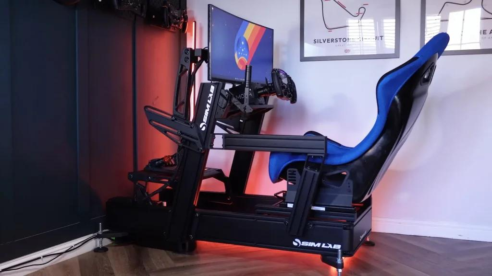

# Tier 3 — The Sweet Spot

<!-- Image source: https://simracingsetup.com/product-guides/best-aluminium-profile-sim-rigs/ -->

<!-- Placeholder — write this page in your own voice. Research for this topic lives in the repo under research/ (not published on this site). -->

## Cost

### $1,800–$2,200

<small>Assumes: existing PC/console, display, dedicated space</small>

## Target user

<!-- TODO -->

## Parts

<!-- TODO -->

## Footprint

<!-- TODO -->

## What it feels like

<!-- TODO -->

## Pros / cons

<!-- TODO -->

## Next upgrade

<!-- TODO -->

## Used-market alternative

<!-- TODO -->

## Related pages

<!-- TODO -->
