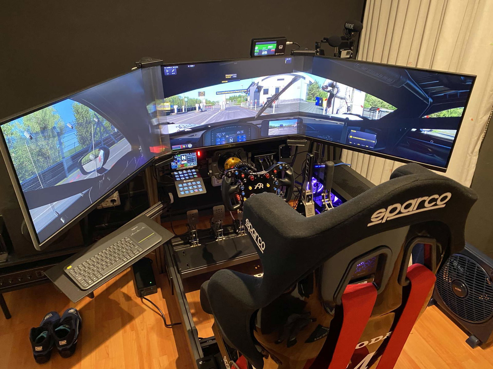

# Tier 4 — Triples / VR Enthusiast

<!-- Image source: https://qubicsystem.com/use-case/ricardo-use-case/ -->

<!-- Placeholder — write this page in your own voice. Research for this topic lives in the repo under research/ (not published on this site). -->

## Cost

### $3,500–$5,500

<small>Assumes: existing PC + display (VR variant ~$5,067; with new PC ~$5,467)</small>

## Target user

<!-- TODO -->

## Parts

<!-- TODO -->

## Footprint

<!-- TODO -->

## What it feels like

<!-- TODO -->

## Pros / cons

<!-- TODO -->

## Next upgrade

<!-- TODO -->

## Used-market alternative

<!-- TODO -->

## Related pages

<!-- TODO -->
