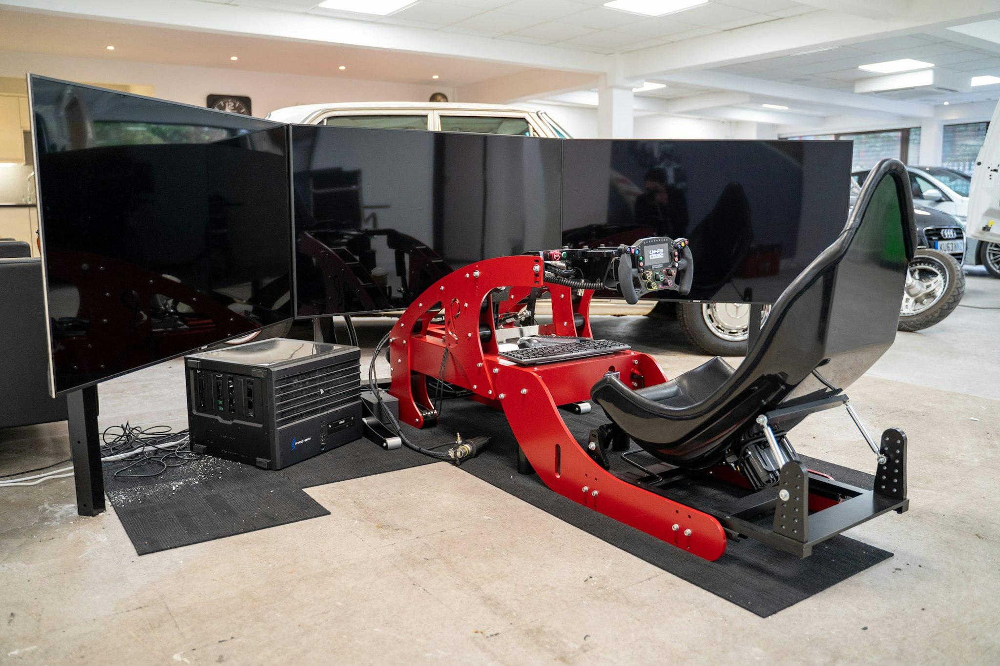

# Tier 5 — Motion / Showpiece

<!-- Image source: https://collectingcars.com/for-sale/pro-sim-formula-evolution-racing-simulator -->

<!-- Placeholder — write this page in your own voice. Research for this topic lives in the repo under research/ (not published on this site). -->

## Cost

### $10,000–$18,000

<small>Assumes: with new PC; DK2+ variant ~$17,458</small>

## Target user

<!-- TODO -->

## Parts

<!-- TODO -->

## Footprint

<!-- TODO -->

## What it feels like

<!-- TODO -->

## Pros / cons

<!-- TODO -->

## Next upgrade

<!-- TODO -->

## Used-market alternative

<!-- TODO -->

## Related pages

<!-- TODO -->
