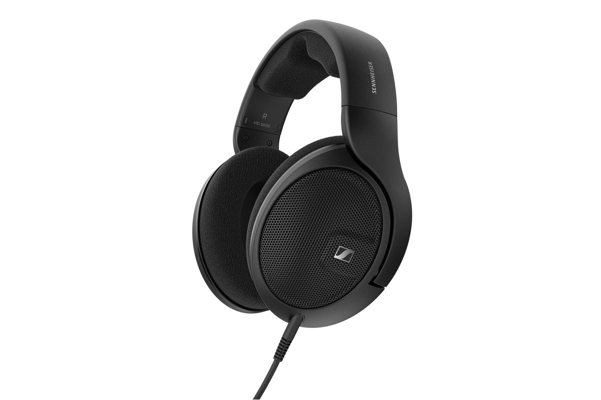

# Sound

<!-- Image source: https://us.sennheiser-hearing.com/products/hd-560s (Sennheiser product photo, padded to 3:2). File: https://us.sennheiser-hearing.com/cdn/shop/files/Sennheiser_HD_560_S_Main_Image.jpg -->

- What: engine and tire noise
- Why: shift timing by ear, cheap immersion
- When: whenever. headphones are fine

<!-- Draft for you to edit. Facts from research-v2/03, 04 and 09 (sources there). Prices USD, checked 2026-10. Budget headset prices are recalled, not verified. -->

## What sound tells you

| Sound | Tells you |
|---|---|
| Tire scrub | Grip is going, before the wheel says so |
| Engine note | When to shift, wheelspin |
| Other cars | Who is beside you |
| Kerbs, bottoming, gravel | Where the car is on the track |

## Hearing it

| Option | Price | Good | Bad |
|---|---|---|---|
| What you own | $0 | Free | TV speakers hide detail |
| Closed gaming headset | Under $100 | Blocks fan and wheel noise, has a mic | Hot, narrower sound |
| Open-back headphones | ~$180 | Best positioning, cooler ears | Leaks sound, lets room noise in |
| Wireless headset, 2.4 GHz dongle | $100 to $350 | No cable | Battery to charge. Not Bluetooth, which lags |
| Desk or rig speakers | Varies | Nothing on your head, others can hear | Less precise, disturbs housemates |
| Surround speakers | $300+ | Real rear sound | Cost, wiring. Skip |

- Mix: turn tires and other cars up, engine and wind down

## Feeling it: bass shakers

- A speaker-like puck bolted to the seat. Plays engine, kerbs, shifts as vibration
- Best immersion per dollar: ~$100 to $180 for a Dayton BST-1, small amp, SimHub
- Not motion. Nothing moves
- Full detail and where to buy: [Motion & Immersion](immersion.md)

## Spotter

- Crew Chief (free, PC): voice calls "car left", "clear", gaps, fuel
- On one screen you cannot see beside you. A spotter is the cheapest safety upgrade

## Ignore

- 7.1 "gaming surround" modes
- Expensive sound cards
- Bluetooth for racing

## By tier

| Tier | Sound |
|---|---|
| 0 to 2 | Headphones you own + Crew Chief |
| 3 | Good headphones, one shaker |
| 4 | Shakers on seat and pedals |
| 5 | Motion plus shakers |

## Where to buy

| Type | Product | Price | Buy |
|---|---|---|---|
| Open-back headphones | Sennheiser HD 560S | $180 | [Sennheiser][hd560] |
| Closed gaming headset | Wired, with mic | Under $100 | [Amazon search][closed] |
| Wireless headset | 2.4 GHz dongle type | $100 to $350 | [Amazon search][wireless] |
| Spotter | Crew Chief | Free | [Crew Chief][crew] |
| Bass shaker | Dayton Audio BST-1 | $55 | [Parts Express][bst1] |

- Sennheiser price checked 2026-10-09 at its US store

## Related pages

- [Motion & Immersion](immersion.md)
- [Chassis & Mounts](chassis-mounts.md)
- [Button Box & Accessories](button-boxes-accessories.md)
- [First Setup](../start/first-setup.md)

[hd560]: https://us.sennheiser-hearing.com/products/hd-560s
[closed]: https://www.amazon.com/s?k=wired+closed+back+gaming+headset
[wireless]: https://www.amazon.com/s?k=2.4GHz+wireless+gaming+headset
[crew]: https://thecrewchief.org/
[bst1]: https://www.parts-express.com/Dayton-Audio-BST-1-High-Power-Pro-Tactile-Bass-Shaker-50-Watts-295-244
