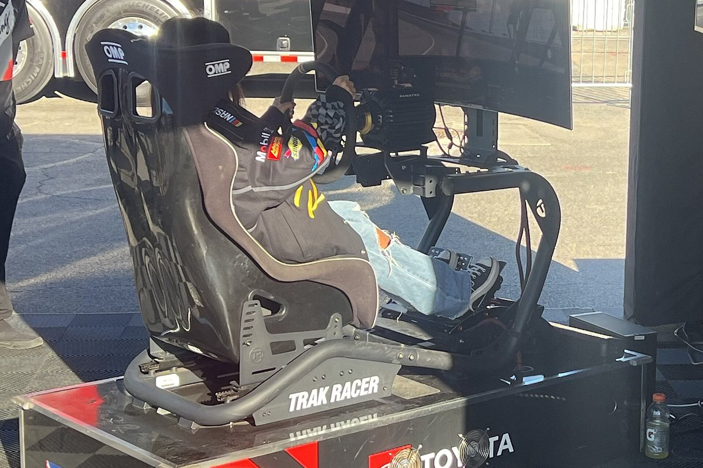
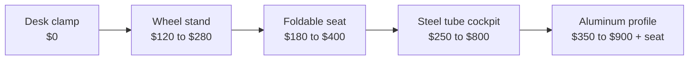

# Chassis & Mounts

<small>Photo: [TaurusEmerald](https://commons.wikimedia.org/wiki/File:Toyota_iRacing_Trak_Racer_Las_Vegas_Fall_2024.jpg), CC BY-SA 4.0, cropped</small>

<!-- Image source: https://commons.wikimedia.org/wiki/File:Toyota_iRacing_Trak_Racer_Las_Vegas_Fall_2024.jpg (CC BY-SA 4.0, TaurusEmerald). Trak Racer steel tube cockpit, cropped -->

- What: the frame. wheelbase, pedals, seat all bolt to it
- Why: flex eats detail. a flexy chassis wastes a good wheelbase
- When: before buying a strong direct drive base

<!-- Draft for you to edit. Facts from research-v2/03 and 09 (sources there). Prices USD, checked 2026-10. Torque limits are maker ratings plus reviewer remarks, not measured. -->

## Varieties

| Type | Examples | Price | Holds | Good | Bad |
|---|---|---|---|---|---|
| Desk clamp | In the box | $0 | 2 to 5 Nm, 8 Nm on a heavy desk | Free, no space | Chair rolls, pedals slide, setup every time |
| Wheel stand | NLR Wheel Stand Lite 2.0 $179, Wheel Stand 2.0 $279, GT Omega APEX $220 | $120 to $280 | ~8 Nm | Folds, use your own chair | Chair still moves |
| Foldable seat | Playseat Challenge X $300, NLR GTLite $199, GTLite Pro $299, GTLite Air $179 | $180 to $400 | ~8 Nm in practice | Real seating position, closet storage | Pedal end flexes under hard braking, no upgrade path |
| Steel tube cockpit | NLR GTRacer 2.0 $499, GT Omega ART $250, Titan $410, Playseat Trophy | $250 to $800 | ~10 Nm | Seat included, looks like furniture | Limited adjustment, proprietary add-ons, replaced later |
| Budget aluminum profile | Trak Racer TR40S $349, RigMetal Basic $409, Amazon 4080 rigs ~$250 to $450 | $250 to $450, no seat | 10 to 16 Nm | Cheapest rigid option | Thin brackets, quality varies |
| Mainstream aluminum profile | Sim-Lab GT1 Evo $390 to $450, Trak Racer TR80S $499, RigMetal Plus $539, ASR 3 $550 | $400 to $600, no seat | 16 Nm+ | Zero flex, fully adjustable, anything bolts on | Industrial look, heavy, extras add up |
| Heavy aluminum profile | Sim-Lab P1X Pro $770 to $790, Trak Racer TR160 $730, P1X Ultimate $877 | $700 to $900, no seat | 30 Nm+, motion | Ready for anything | Overkill for a beginner |
| DIY | Wood rig ~$50, aluminum from a local extrusion supplier ~$300 to $500 | $50 to $500 | Varies | Cheap, custom | Your time |

## What matters

- Nothing moves when you brake hard. Pedal end first, wheel deck second
- Wheel deck and pedal deck that fit your gear's bolt pattern
- Adjustability: seat, pedal and wheel distance and angle
- Where the monitor goes
- Whether it has to pack away
- Build quality: a tight, square 4080 rig beats a loose bigger one

## Ignore

- 40160 vs 4080 profile, below ~20 Nm. Not a performance upgrade for a beginner
- Maker torque ratings on foldables. Survival ratings, not flex-free
- Looks
- Brand accessories. Profile rigs take anything with a T-nut

## Profile sizes

- The number is the beam cross-section in mm: 4080 = 40×80
- 4080: fine to ~16 Nm. Enough for any first rig
- 40120 / 40160: for 20 Nm+, very stiff pedals, motion
- Price gap is small. Overbuying slightly is fine, not needed

## Real cost of a profile rig

| Part | Typical |
|---|---|
| Rig | $400 to $600 |
| Seat | $230 to $450, or a junkyard car seat $50 to $75 |
| Seat brackets, slider | $40 to $90 |
| Monitor mount | $130 to $400 |
| Shipping | $30 to $250 |

- A "$499 rig" is $900 to $1,100 sat in and driving
- Arrives in 2 to 3 heavy boxes. 3 to 6 hours to build
- Popular rigs are often back-ordered. Check stock first

## Desk fixes

| Problem | Fix |
|---|---|
| Chair rolls back | Caster cups, or rear wheels in old shoes |
| Chair swivels | Dining chair, or strap chair to desk leg |
| Pedals slide | Against the wall, or screwed to a board the chair sits on |
| Desk shakes | Push to wall, lower force feedback |
| Clamp slips | Wood shim under the desk edge |

## Monitor mounts

- Integrated: bolts to the rig. Cheap, compact. Shakes with a strong wheel
- Freestanding: separate stand. No shake. $275 to $365 for triples
- Desk arms: not for triples. They sag

## Motion

- Actuators go under the rig, so the rig must be rigid: heavy aluminum profile
- Affordable 3DOF arrived in 2026: Moza HMA150, $2,999 for four actuators
- Leave room: cables, monitor stand, walls
- Last purchase, or never
- Full detail, 3DOF vs 6DOF, belt tensioners: [Motion & Immersion](immersion.md)

## By tier

- Tier 0: desk clamp
- Tier 1: foldable seat or wheel stand
- Tier 2: steel tube cockpit, or jump to profile
- Tier 3: mainstream aluminum profile
- Tier 4: heavy aluminum profile
- Tier 5: heavy profile on motion

## Used

- Aluminum rigs: best used buy in the hobby. Local pickup
- Check: 40-series profile, all brackets and T-nuts, deck hole patterns
- Foldables: seams, hinges, bent tubes
- Avoid: wood or PVC rigs priced like aluminum

## Related pages

- [Motion & Immersion](immersion.md)
- [Seat](seating.md)
- [Wheelbase](wheelbases.md)
- [Pedals](pedals.md)
- [Displays](displays-vr.md)
- [Sound](audio.md)
