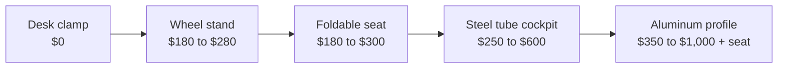

# Chassis & Mounts

<!-- Image source: https://sim-lab.us/products/p1x-pro-simracing-cockpit (Sim-Lab product image, cropped). File: https://sim-lab.us/cdn/shop/files/PX1_Pro_Wheeldeck_fde90d8f-60bd-4954-80d8-ef52782408c1.jpg -->

- What: the frame. wheelbase, pedals, seat all bolt to it
- Why: flex eats detail. a flexy chassis wastes a good wheelbase
- When: after a direct drive base and a load cell brake. more torque and a stiffer brake both need it

<!-- Draft for you to edit. Facts from research-v2/03, 09 and 12 (sources there). Prices USD, listings checked 2026-10-09. Torque limits are maker ratings plus reviewer remarks, not measured. -->

## Varieties

| Type | Price | Wheelbase limit | Good | Bad |
|---|---|---|---|---|
| Desk clamp | $0, in the box | 2 to 5 Nm, 8 Nm on a heavy desk | Free, no space | Chair rolls, pedals slide, setup every time |
| Wheel stand | $180 to $280 | ~8 Nm | Folds, use your own chair | Chair still moves |
| Foldable seat | $180 to $300 | ~8 Nm in practice | Real seating position, closet storage | Pedal end flexes under hard braking, no upgrade path |
| Steel tube cockpit | $250 to $600 | ~10 Nm | Seat included, tidy enough for a living room | Limited adjustment, proprietary add-ons, replaced later |
| Budget aluminum profile | $350 to $450, no seat | 10 to 16 Nm | Cheapest rigid option | Thin brackets, quality varies |
| Mainstream aluminum profile | $450 to $600, no seat | 16 Nm+ | Zero flex, fully adjustable, anything bolts on | Industrial look, heavy, extras add up |
| Heavy aluminum profile | $730 to $1,000, no seat | 30 Nm+, motion | Ready for anything | Overkill for a beginner |
| DIY | $50 to $500 | Varies | Cheap, custom | Your time |

- Aluminum profile is the standard. Even the cheapest is rigid enough for 5 to 8 Nm
- Most recommended on r/simracing: Sim-Lab, RigMetal
- Foldables and stands work with direct drive at low torque. Flex shows with a stiff load cell brake or more torque

## What matters

- Nothing moves when you brake hard. Pedal end first, wheel deck second
- Wheel deck and pedal deck that fit your gear's bolt pattern
- Adjustability: seat, pedal and wheel distance and angle
- Where the monitor goes
- Whether it has to pack away. Pack-away rigs only get used if setup takes about a minute
- Build quality: a tight, square 4080 rig beats a loose bigger one

## Ignore

- 40160 vs 4080 profile, below ~20 Nm. Not a performance upgrade for a beginner
- Maker torque ratings on foldables. They say what it survives, not what stays stiff
- Looks
- Brand accessories. Profile rigs take anything with a T-nut

## Profile sizes

| Profile | Beam, mm | Good for |
|---|---|---|
| 4080 | 40×80 | Up to ~16 Nm. Enough for any first rig |
| 40120 / 40160 | 40×120 / 40×160 | 20 Nm+, very stiff pedals, motion |

- The price gap is small. Overbuying slightly is fine, not needed

## Real cost of a profile rig

| Part | Typical |
|---|---|
| Rig | $350 to $600 |
| Seat | $250 to $450, or a junkyard car seat $50 to $75 |
| Seat brackets, slider | $40 to $120 |
| Monitor stand | $200 to $360 |
| Shipping | $30 to $250 |

- A "$499 rig" is $900 to $1,100 sat in and driving
- Arrives in 2 to 3 heavy boxes. 3 to 6 hours to build
- Popular rigs are often back-ordered. Check stock first

## Desk fixes

| Problem | Fix |
|---|---|
| Chair rolls back | Caster cups, or rear wheels in old shoes |
| Chair swivels | Dining chair, or strap chair to desk leg |
| Pedals slide | Against the wall, or screwed to a board the chair sits on |
| Desk shakes | Push to wall, lower force feedback |
| Clamp slips | Wood shim under the desk edge |

## Mounts and extras

| Mount | Notes |
|---|---|
| Monitor, integrated | Bolts to the rig. Compact. Shakes with a strong wheel |
| Monitor, freestanding | Separate stand. No shake |
| Desk arms | Not for triples. They sag |
| Shifter, handbrake, button box | Side mounts bolt to any profile rig |
| Casters | Lockable only, or the rig rolls under braking |

## Motion

- Actuators go under the rig, so the rig must be rigid: heavy aluminum profile
- Affordable 3DOF arrived in 2026: Moza HMA150, $2,999 for four actuators
- Leave room: cables, monitor stand, walls
- Last purchase, or never
- Full detail, 3DOF vs 6DOF, belt tensioners: [Motion & Immersion](immersion.md)

## By tier

| Tier | Mount |
|---|---|
| 0 | Desk clamp |
| 1 | Foldable seat or wheel stand |
| 2 | Steel tube cockpit, or jump to profile |
| 3 | Mainstream aluminum profile |
| 4 | Heavy aluminum profile |
| 5 | Heavy profile on motion |

## Used

- Aluminum rigs: best used buy in the hobby. Local pickup. Often sell for foldable-seat money
- Check: 40-series profile, all brackets and T-nuts, deck hole patterns
- Foldables: seams, hinges, bent tubes
- Avoid: wood or PVC rigs priced like aluminum

## Where to buy

| Type | Product | Price | Buy |
|---|---|---|---|
| Wheel stand | NLR Wheel Stand Lite 2.0 | $179 | [Next Level Racing][wsl] |
| Wheel stand | GT Omega APEX | $220 | [GT Omega][apex] |
| Wheel stand | NLR Wheel Stand 2.0 | $279 | [Next Level Racing][ws2] |
| Foldable seat | NLR GTLite Air | $179 | [Next Level Racing][gtla] |
| Foldable seat | NLR GTLite | $199 | [Next Level Racing][gtl] |
| Foldable seat | NLR GTLite Pro | $299 | [Next Level Racing][gtlp] |
| Foldable seat | Playseat Challenge X | $300 | [Logitech G][pcx] |
| Steel tube cockpit | GT Omega ART | $250 | [GT Omega][art] |
| Steel tube cockpit | GT Omega Titan | $410 | [GT Omega][titan] |
| Steel tube cockpit | NLR GTRacer 2.0, seat included | $499 | [Next Level Racing][gtr] |
| Steel tube cockpit | Playseat Trophy | ~$600 | [Logitech][trophy] |
| Budget profile | Trak Racer TR40S | $349 | [Trak Racer][tr40] |
| Budget profile | RigMetal Basic | $409 | [RigMetal][rmb] |
| Budget profile | No-name 4080 rigs | $250 to $450 | [Amazon search][amz] |
| Mainstream profile | Sim-Lab GT1 Evo | $449 | [Sim-Lab US][gt1] |
| Mainstream profile | Trak Racer TR80S | $499 | [Trak Racer][tr80] |
| Mainstream profile | RigMetal Plus | $539 | [RigMetal][rmp] |
| Mainstream profile | ASR 3 | ~$550 | [Advanced SimRacing][asr3] |
| Heavy profile | Trak Racer TR160 V5 | $730 | [Trak Racer][tr160] |
| Heavy profile | Sim-Lab P1X Pro | $789 | [Sim-Lab US][p1x] |
| Heavy profile | Sim-Lab P1X Ultimate | $999 | [Sim-Lab US][p1xu] |
| Monitor stand, single | NLR freestanding single | $199 | [Next Level Racing][mon1] |
| Monitor stand, single | Trak Racer cockpit-mounted single | $229 | [Trak Racer][mon1t] |
| Monitor stand, triple | NLR freestanding triple, up to 3× 43" | $299 | [Next Level Racing][mon3] |
| Monitor stand, triple | Trak Racer freestanding triple, 22" to 32" | $359 | [Trak Racer][mon3t] |
| Casters | Sim-Lab caster set | $30 | [Sim-Lab US][cast] |

- Prices checked 2026-10-09 at the maker's own US store. Shipping and tax extra
- Out of stock when checked: Sim-Lab GT1 Evo, RigMetal Basic

## Related pages

- [Motion & Immersion](immersion.md)
- [Seat](seating.md)
- [Wheelbase](wheelbases.md)
- [Pedals](pedals.md)
- [Displays](displays-vr.md)
- [Sound](audio.md)

[wsl]: https://store-us.nextlevelracing.com/products/next-level-racing-ws-lite-2-0
[ws2]: https://store-us.nextlevelracing.com/products/next-level-racing-wheel-stand-2-0
[apex]: https://www.gtomega.com/products/apex-steering-wheel-stand
[gtla]: https://store-us.nextlevelracing.com/products/gtlite-air
[gtl]: https://store-us.nextlevelracing.com/products/gtlite
[gtlp]: https://store-us.nextlevelracing.com/products/gtlite-pro
[pcx]: https://www.logitechg.com/en-us/shop/p/playseat-challenge-x-sim-racing-seat
[art]: https://www.gtomega.com/products/art-racing-cockpit
[titan]: https://www.gtomega.com/products/titan-cockpit
[gtr]: https://store-us.nextlevelracing.com/products/gtracer-2-0-simulator-cockpit
[trophy]: https://www.logitech.com/en-us/shop/p/playseat-trophy-sim-racing-seat
[tr40]: https://trakracer.com/products/tr40s-racing-simulator
[rmb]: https://rigmetal.com/products/rigmetal-basic-sim-racing-cockpit
[amz]: https://www.amazon.com/s?k=4080+aluminum+profile+sim+racing+cockpit
[gt1]: https://sim-lab.us/products/gt1-evo-simracing-cockpit
[tr80]: https://trakracer.com/products/tr80s-racing-simulator
[rmp]: https://rigmetal.com/products/rigmetal-plus-sim-racing-cockpit
[asr3]: https://www.advancedsimracing.com/products/asr-3
[tr160]: https://trakracer.com/products/tr160-v5
[p1x]: https://sim-lab.us/products/p1x-pro-simracing-cockpit
[p1xu]: https://sim-lab.us/products/p1x-ultimate-simracing-cockpit
[mon1]: https://store-us.nextlevelracing.com/products/round-tube-freestanding-single-monitor-stand
[mon1t]: https://trakracer.com/products/tr8020-single-monitor-stand-2
[mon3]: https://store-us.nextlevelracing.com/products/round-tube-freestanding-triple-monitor-stand
[mon3t]: https://trakracer.com/products/floor-stand-holds-22-33
[cast]: https://sim-lab.us/products/caster-wheels-set
