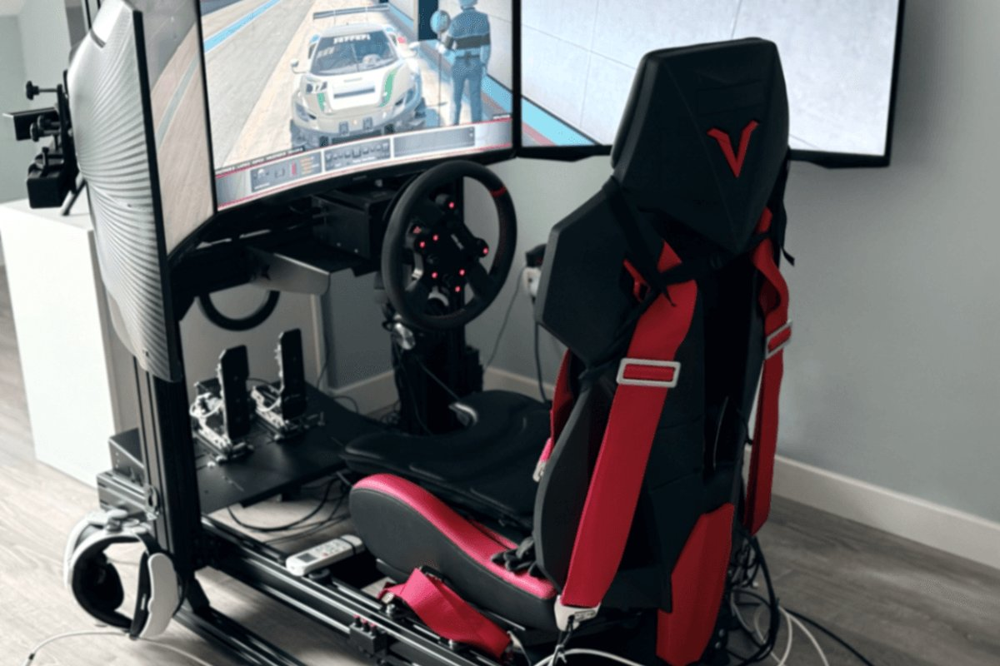

# Displays

<!-- Image source: https://unsplash.com/photos/race-car-simulators-offer-an-immersive-driving-experience-1RARtUwaXQs (Unsplash license, Ben A) -->

- What: single, ultrawide, triples, or VR
- Why: seeing the apex and the car next to you
- When: after wheelbase and pedals

<!-- Draft for you to edit. Facts from research-v2/04, 10, 11 and 12 (sources there). r/simracing views from 12. Prices USD, checked 2026-10. View angles are geometry, not quoted. Triple monitor picks rest on one r/simracing thread: check current models and prices. -->

## Varieties

| Type | View | Price | PC load | Good | Bad |
|---|---|---|---|---|---|
| Living-room TV | ~27° from the couch | Owned | Low | Free, fine for console | Too far away, tiny real view |
| Single 27" 1440p | ~46° at 70 cm | $200 to $300, OLED from ~$300 | Low | Cheapest, works everywhere | No side view |
| Single 32" | ~54° | $300 | Low to medium | Work and play | Same |
| 34" ultrawide | ~60° | $300 to $450, OLED ~$730 | Medium | No bezels, one cable. Default pick | Still can't see a car alongside |
| 49" super-ultrawide | 80 to 100° | $650 to $900, OLED $1,100+ | High | Wide view on one cable, nothing to align | Less side view than triples, edges distort in some games |
| Triple 27" | 140 to 155° | $570 to $900 + stand $275 | High | See cars beside you, 1:1 scale | 1.6 to 1.8 m wide, setup work, not all games |
| Triple 32" | 160 to 170° | $600 to $1,200 + stand $365 | High | Feels like a cockpit. The pick if you have the room | 2 m wide, dedicated room |
| 42 to 48" OLED TV | ~60° at 85 cm | $1,000 to $1,600 | High | Best picture, great for console | Needs a floor stand |
| VR | 100 to 140° plus head turn | $350 to $2,300 | Very high | True depth and scale, no floor space | Heat, nausea for some, can't see your buttons |

## Which one

| You | Pick |
|---|---|
| Starting out | The screen you own, moved close. Then a 34" ultrawide |
| Wheel-to-wheel online racing | Triples or VR |
| F1 25, EA WRC, Forza | Single or ultrawide. Triples only stretch |
| Tiny room | VR or a single screen |
| Shared room, people watching | Screens |
| Console | One screen. PlayStation adds PS VR2 for Gran Turismo 7 |

- Triples vs VR: no winner. Depends on the driver
- VR: best depth and immersion. The top immersion upgrade on r/simracing
- Triples: sit down and drive. No heat, no eye strain, easy in long races
- r/simracing in 2026: most switch stories go VR to triples, for comfort. Some switch back, many keep both

## What matters

- Distance: screen right behind the wheelbase. Closer beats bigger
    - A wheel shaft extension (~EUR 50) lets the screen sit lower and closer, behind the wheel
- Correct field of view. See [First Setup](../start/first-setup.md)
- 120 to 165 Hz, held steady
- Which games you play. Not all do triples properly
- What your PC can drive. See [PC / Console](pc-console.md)
    - Triple 1080p is about as heavy as one 4K screen
    - Triple 1440p wants an RTX 5070 Ti

## Ignore

- 240 Hz and up
- "1 ms" claims
- 4K on a 27"
- Triple 4K. Even an RTX 5090 does not hold 120 fps
- Bezel-hiding kits. Your brain ignores the gaps
- Tight 1000R curves for triples
- HDR, at first

## Triples

- Three identical monitors, thin bezels, VESA holes
- Sweet spot: 32" 1440p. 27" 1080p if the PC is weak
- Flat, or a gentle curve (1500R or flatter). Sims assume flat panels
- A freestanding stand. Desk arms sag
- Budget pick: AOC CQ32G4VE, 32" 1440p, 1500R, ~EUR 170 each
- Also common: Samsung Odyssey G5 32" 1440p

| Proper per-screen view | Stretch only |
|---|---|
| iRacing | F1 25 |
| Assetto Corsa, ACC, AC EVO | EA Sports WRC |
| Le Mans Ultimate | Forza Motorsport |
| Automobilista 2 | Any console game (one screen only) |
| rFactor 2, RaceRoom | |

## VR

| Level | Headset | Price | Per eye | Notes |
|---|---|---|---|---|
| Try it | Meta Quest 3S | $350 | 1832 x 1920 | Cheapest test |
| Default | Meta Quest 3 | $600 | 2064 x 2208 | Easy, wireless. The PC picture is streamed and compressed. The first headset to buy |
| Console | PS VR2 | $399 | 2000 x 2040 OLED | Gran Turismo 7 on PS5. Works on PC with an adapter. Good value used |
| Wireless PC | Valve Steam Frame | $1,059 | 2160 x 2160 | New, Sept 2026, sold by lottery. Streamed only, no cable. Too new for owner reports |
| Sharp, cheaper | Pimax Crystal Light | ~$700 to $900 | 2880 x 2880 | Sharp, but heavy: 800 g+ on your head |
| Light | Bigscreen Beyond 2 | ~$960 to $1,020 + base stations | 2560 x 2560 OLED | 107 g. Needs base stations |
| Light, mid GPU | Pimax Dream Air SE | $899 + base stations, or $1,199 self-tracking | 2560 x 2560 OLED | Under 140 g. Easier on the GPU than the full Dream Air |
| Sharpest | Pimax Dream Air | $1,999 + base stations, or $2,299 self-tracking | 3840 x 3552 OLED | 90 Hz, eye tracking. Nothing else is this sharp and this light. Divides owners |

- Try a Quest before spending $900+
- Own a Quest 3 and happy: no reason to upgrade
- Needs a steady 72 to 90 frames per second
- Resolution costs GPU. A sharp headset on a mid PC looks worse than a Quest 3 running smoothly
- You sit still and face forward, so tracking matters less than in other VR games
- Base stations: tracking boxes on the wall. Not in the box. Budget $300+ and check stock
- Announced, not out: Pimax Crystal Pro, $1,399, wireless

### Pimax Dream Air

- The draw: about 4K per eye, OLED, at roughly half the weight of a Quest 3
- Needs an RTX 4090 or 5090. A 5090 owner still lowered settings
- 90 Hz. On OLED that is enough
- Owners are split
    - For: "Pimax looks like you're there, while Quest 3 makes you feel you're playing a game". Some sold their triples
    - Against: fiddly setup, OLED smearing, face pad comfort, short cable. One RTX 5090 owner sent it back and bought triples
- Self-tracking version: tracking now rated on par with Quest 3. Costs more, needs nothing on the wall
- Price is split: part up front, the rest after a 14-day trial. Add both
- "170 g" is the visor alone. ~300 g with the strap, per one review

## Panel types

| Type | Good | Bad |
|---|---|---|
| IPS | Wide viewing angle, good for triple side screens | Gray blacks |
| VA | Deep blacks, cheap, most curved ultrawides | Dark smearing on cheap ones, narrow angles |
| OLED | Instant response, perfect black. Best for night and endurance racing | Burn-in risk from static dashboards over years, price |

## By tier

- Tier 0 to 1: what you own, moved close
- Tier 2: single 27" or 34" ultrawide
- Tier 3: 34" ultrawide
- Tier 4: triples, or VR (Quest 3, Dream Air SE)
- Tier 5: triple 32", or Pimax Dream Air

## Used

- Monitors and stands: plentiful, low risk
- Triples: same model and revision
- Check: dead pixels, backlight bleed, VESA holes
- VR: lens scratches and sun burns are fatal. Factory reset
- Avoid Windows Mixed Reality headsets (HP Reverb). Microsoft ended support

## Related pages

- [PC / Console](pc-console.md)
- [Chassis & Mounts](chassis-mounts.md)
- [Motion & Immersion](immersion.md)
- [First Setup](../start/first-setup.md)
- [Tier 4: Triples / VR Enthusiast](../builds/tier-4-triples-vr-enthusiast.md)
