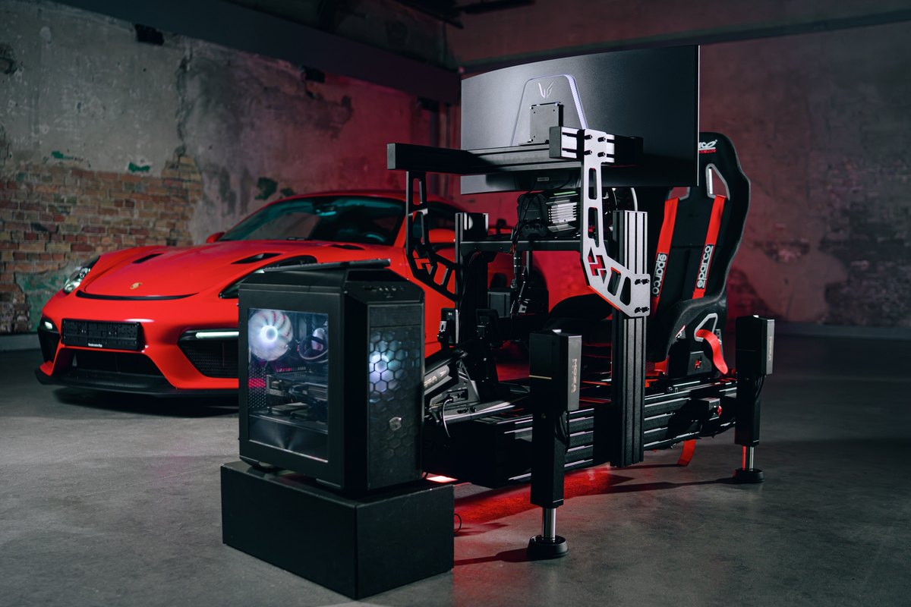
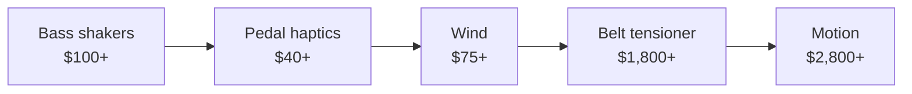

# Motion & Immersion

<!-- Image source: https://us.mozaracing.com/products/hma150 (Moza product photo). File: https://us.mozaracing.com/cdn/shop/files/HMA1507.jpg -->

!!! info "NEW PAGE"
    Added by Claude on 2026-10-09. Not in the original site plan. Keep, edit or delete.

- What: add-ons that make you feel the car. shakers, belts, wind, motion
- Why: immersion. not lap time
- When: last. after rig, pedals, wheelbase, screens

<!-- Draft for you to edit. Facts from research-v2/11, 12, 03 and 09 (sources there). r/simracing views from 12. Prices USD, listings checked 2026-10-09. Wind: only showcase threads found on r/simracing, no debate threads. -->

## Buy order

## Varieties

| Add-on | You feel | Price | Moves you? |
|---|---|---|---|
| Bass shakers | Engine, kerbs, shifts, wheel slip | $100 to $350 | No. Vibration only |
| Pedal haptics | ABS, lockup, wheelspin under your foot | $40 to $150 a pedal | No |
| Wind | Speed on your face. Also cooling in VR | $75 to $650 | No |
| Belt tensioner | Harness pulls tight under braking | $1,400 to $1,850 | Squeezes you |
| G-seat | Seat panels press into you in corners | ~$3,000 | Squeezes you |
| Seat mover | Seat tilts | $1,500 to $2,800 | Yes, 2DOF |
| Actuators under the rig | Whole rig tilts and lifts | $3,000 to $11,000 | Yes, 3DOF |
| Traction loss, 6DOF | Rear slides out, rig shifts sideways | $4,400+ | Yes, 4 to 6DOF |

- All of it is PC only. It runs on game telemetry
- Exception: a shaker fed from the audio output works on console

## Bass shakers

- A speaker-like puck bolted to the seat or pedal plate. Plays the car as vibration
- Not motion. Nothing moves, it buzzes and thumps
- Driven by SimHub through a small amp

| Level | Kit | Price | Notes |
|---|---|---|---|
| Starter | Dayton puck (TT25) + small amp | ~$50 to $90 | Weak. Pedal plate or a light seat |
| Default | 1 or 2 Dayton BST-1 + small amp (Fosi, Nobsound) + SimHub | ~$130 to $190 | Best value. Two shakers, amp and USB sound card: ~$190 |
| Stronger | Dayton BST-300EX + bigger amp | $95 each + amp | Needs a rigid rig |
| Plug and play | ButtKicker Gamer Plus / Pro | $280 / $350 | Amp and clamp included |
| Four corners | 4 shakers + 4-channel amp | $415 to $1,300 | Left / right and front / rear effects. Diminishing returns |

| Setup | Rule |
|---|---|
| Where | On the seat, not the frame. Quieter, and you feel more |
| Floor | Rubber feet under the rig. Vibration travels through floors |
| First effects | RPM and gear shift. Then road bumps and kerbs |
| Level | Each effect at 10 to 20%. Too many at once feels like noise |
| Four corners | You cannot tell the wheels apart. Still adds immersion |

- Best immersion per dollar in the hobby
- Works on an office chair or foldable too
- Not for everyone. Some send them back and keep pedal haptics

## Pedal haptics

- Small motor on the pedal. ABS and lockup on the brake, wheelspin on the throttle
- Useful, not just fun: you feel the lock before you see it
- Simagic P-HPR: $39 to $49 each plus power supply. Fits Simagic pedals, adapters exist for others
- Cheap route: a Dayton puck under the pedal plate. Weaker than real pedal haptics
- Active pedals (Simucube ActivePedal, Moza mBooster) do this and more. See [Pedals](pedals.md)

## Wind

- Fans on the rig. Speed follows the car's speed through SimHub
- Best in VR: cools your face. Some find it eases nausea
- A desk fan does half the job for free
- DIY controller + PC fans: ~$75
- Ready kits, two fans: $220 to $650
- Console: fans on a manual dial work without telemetry
- Owners like it. Nobody calls it essential

## Belt tensioner

- Motors pull the harness tight under braking, loosen on throttle
- Does what motion cannot: holds pressure for the whole braking zone
- r/simracing: buy it before motion. Owners with both say the belt adds more on its own
- Helps braking, not just immersion
- Qubic QS-BT1: $1,799. Silent
- DIY SimHub tensioner: under $1,000, noisy
- Needs a bucket seat with harness slots and a 4 to 6 point harness

## Motion: the six directions

| Axis | Movement | Feels like |
|---|---|---|
| Pitch | Nose tilts up / down | Braking, acceleration |
| Roll | Tilts left / right | Cornering load |
| Heave | Whole rig up / down | Kerbs, bumps, crests |
| Yaw | Rear swings around | The back stepping out |
| Surge | Slides forward / back | Braking, acceleration, without tilting |
| Sway | Slides left / right | Cornering, without tilting |

- DOF = degrees of freedom = how many of these a platform does

## 3DOF vs 6DOF

| | 3DOF | 6DOF |
|---|---|---|
| Axes | Pitch, roll, heave | All six |
| Hardware | 4 actuators under the rig | Hexapod, or 3DOF plus sliding base (surge, sway, traction loss) |
| Price | $3,000 to $11,000 | $4,400 to $30,000+ (est) |
| Space | Rig footprint plus a little clearance | Much more, in every direction |
| Slides | Hinted at through roll | Felt directly through yaw |
| Who | Home rigs. The normal choice | Enthusiasts with the room, pro simulators |

| In between | What |
|---|---|
| 2DOF | Pitch + roll. Seat movers |
| 4DOF | 3DOF + rear traction loss (yaw). The useful middle step |

- Yaw is the upgrade that matters for drift, rally, catching slides
- Surge and sway add little on their own
- No home platform holds a sustained g-force. Motion gives the first hit, then eases back
- More DOF is not automatically better. Most guides are written by sellers
- Owners on r/simracing: "it's awesome but for fun, it's not going to make you faster"
- DIY route: SFX100 actuators run from SimHub

## Motion levels

| Level | Price | Notes |
|---|---|---|
| 2DOF | $1,500 to $2,800 | Seat movers leave wheel and pedals still, which feels odd to some |
| Affordable 3DOF | $2,600 to $3,000 | The 2026 change. Motion at half the old price |
| Premium 3DOF | $6,000 to $11,300 | Faster, quieter, proven |
| 6DOF | $4,400 to $30,000+ (est) | Room-sized commitment. Sliding parts add noise |

## Moza HMA150

| | |
|---|---|
| What | Moza's first motion product: four actuators that bolt under an aluminum profile rig |
| Price | $2,999, controller built in. About half the price of the D-BOX class |
| Motion | 3DOF: pitch, roll, heave. Carries 350 kg, rig and driver included |
| Shipping | Since Oct 2026. EU preorders mid-November |
| First owners | Quiet for the driver, heard downstairs. Good build. Tiring to drive |
| Early review | One failed cable, loud first power supplies (since revised). Its built-in vibration does not replace shakers |
| Not there yet | SimHub support, VR motion compensation |
| Extra | "AI Motion" makes motion for games that send no telemetry |
| Risk | First generation. Long-term reliability unknown |

## What matters

- Shakers: on the seat, few effects, kept low
- Belt tensioner before motion
- Motion: a rigid aluminum profile rig first. Motion on a flexy rig is wasted
- Motion: speed and smoothness of the actuators, not travel
- Motion: software. Game support, ease of tuning
- Noise, and who lives below you
- Cable clearance. Nothing may pinch as the rig moves
- VR on a moving rig needs motion compensation set up, or the view drifts

## Ignore

- Lap time claims. A static rig is more repeatable under braking
- Big travel numbers
- 6DOF for a home rig
- Motion before load cell pedals and a direct drive base
- A harness without a tensioner. Decoration
- Four-corner shakers, at first

## By tier

| Tier | Immersion |
|---|---|
| 0 to 2 | None. A desk fan |
| 3 | One shaker under the seat |
| 4 | Shakers on seat and pedals, wind if in VR |
| 5 | 3DOF motion, belt tensioner, shakers |

## Used

- Shakers and amps: low risk. Nothing to wear out
- Actuators: listen for knocking. Controller, cables, brackets all present
- Ask if the motion software license transfers
- Avoid: undocumented DIY motion

## Where to buy

| Type | Product | Price | Buy |
|---|---|---|---|
| Bass shaker | Dayton Audio TT25-8 puck | $18, $65 for four | [Parts Express][tt25] |
| Bass shaker | Dayton Audio BST-1 | $55 | [Parts Express][bst1] |
| Bass shaker | Dayton Audio BST-300EX | $95 | [Parts Express][bst300] |
| Shaker amp | Fosi Audio BT20A, 2 channels | $72 | [Parts Express][amp] |
| Shaker amp | Nobsound mini amps | $30 to $60 | [Amazon search][nob] |
| USB sound card | Sabrent AU-MMSA | $9 | [Sabrent][snd] |
| Shaker kit | ButtKicker Gamer Plus | $280 | [ButtKicker][bkplus] |
| Shaker kit | ButtKicker Gamer Pro | $350 | [ButtKicker][bkpro] |
| Pedal haptics | Simagic P-HPR GT | $39 | [Trak Racer][hpr] |
| Software | SimHub | Free, license from EUR 8 | [SimHub][simhub] |
| Wind | Sim Racing Studio Hurricane kit, two fans | ~$220 | [Sim Racing Studio][srs] |
| Wind | RaceKraft Dual Wind Simulator Kit V2 | $650 | [RaceKraft][wind] |
| Belt tensioner | Qubic QS-BT1 | $1,799 | [Trak Racer][bt1] |
| Belt tensioner | SimXperience G-Belt | ~$1,365 | [SimXperience][simx] |
| G-seat | SimXperience GS-5 | ~$3,000 | [SimXperience][gs5] |
| Motion, 2DOF seat mover | DOF Reality M2 | ~$1,500 | [DOF Reality][dof] |
| Motion, 2DOF seat mover | NLR Motion Platform V3 | $2,799 | [Next Level Racing][mv3] |
| Motion, 2DOF whole rig | NLR Motion Plus | $2,799 | [Next Level Racing][mplus] |
| Motion, 3DOF | eRacing Lab RS MEGA+ | $2,600 | [eRacing Lab][mega] |
| Motion, 3DOF | Moza HMA150, four actuators | $2,999 | [Moza US][hma] |
| Motion, 3DOF | DOF Reality H3 | ~$3,000 | [DOF Reality][dof] |
| Motion, 3DOF | D-BOX G5 4250i, four actuators | $5,990 | [Trak Racer][dbox] |
| Motion, 3DOF | Qubic QS-210 | $8,671 | [Podium1][qs210] |
| Motion, 3DOF | Qubic QS-220 | $11,330 | [Podium1][qs220] |
| Motion, 6DOF | eRacing Lab RS Ultimate Gen 2 | $4,380 | [eRacing Lab][rsu] |
| Motion, 6DOF | DOF Reality H6 | ~$7,000 | [DOF Reality][dof] |
| Motion, DIY | SFX-100 plans and parts list | Parts only | [OpenSFX][sfx] |

- Prices checked 2026-10-09. Parts Express, Moza, Trak Racer, Podium1, eRacing Lab, RaceKraft and Next Level Racing from live store listings
- ButtKicker Gamer Plus and Pro were out of stock when checked
- D-BOX with a rig: Trak Racer sells the TR160 V5 rig plus the four actuators as [one bundle][dboxrig] for $6,384
- DOF Reality and SimXperience prices are from earlier research, not rechecked

## Related pages

- [Sound](audio.md)
- [Chassis & Mounts](chassis-mounts.md)
- [Seat](seating.md)
- [Displays](displays-vr.md)
- [Tier 5: Motion / Pro](../builds/tier-5-motion-pro.md)

[tt25]: https://www.parts-express.com/Dayton-Audio-TT25-8-PUCK-Tactile-Transducer-Mini-Bass-Shaker-8-Ohm-4-Pack-300-391
[bst1]: https://www.parts-express.com/Dayton-Audio-BST-1-High-Power-Pro-Tactile-Bass-Shaker-50-Watts-295-244
[bst300]: https://www.parts-express.com/Dayton-Audio-BST-300EX-High-Power-Pro-Tactile-Bass-Shaker-100-Watts-295-243
[amp]: https://www.parts-express.com/Fosi-Audio-BT20A-Bluetooth-Stereo-Hi-Fi-Amplifier-100W-x-2-235-250
[nob]: https://www.amazon.com/s?k=Nobsound+mini+amplifier
[snd]: https://sabrent.com/products/au-mmsa
[bkplus]: https://thebuttkicker.com/products/buttkicker-gamer-plus
[bkpro]: https://thebuttkicker.com/products/buttkicker-gamer-pro
[hpr]: https://trakracer.com/products/simagic-p-hpr-gt-linear-haptic-pedal-reactor
[simhub]: https://www.simhubdash.com/
[srs]: https://www.simracingstudio.com/
[wind]: https://racekraft.net/products/wind-simulator
[bt1]: https://trakracer.com/products/qubic-system-qs-bt1-direct-drive-seat-belt-tensioner-with-trak-racer-seat-harness-red
[simx]: https://www.simxperience.com/
[gs5]: https://www.simxperience.com/blog/simxperience-news-1/simxperience-gs-5-g-force-seat-available-now-35
[dof]: https://dofreality.com/
[mv3]: https://store-us.nextlevelracing.com/products/next-level-racing-motion-simulator-platform-v3-1
[mplus]: https://store-us.nextlevelracing.com/products/next-level-racing-motion-plus
[mega]: https://eracing-lab.com/products/rs-mega-plus
[hma]: https://us.mozaracing.com/products/hma150
[dbox]: https://trakracer.com/products/d-box-generation-5-4250i-haptic-system-1-5-travel-range-4-actuators
[dboxrig]: https://trakracer.com/products/tr160-v5-racing-simulator-with-set-of-4-d-box-g5-4250i-motion-actuators
[qs210]: https://podium1racing.com/products/qubic-qs-210-r2-box-actuators
[qs220]: https://podium1racing.com/products/qubic-qs-220-r4-box-actuators
[rsu]: https://eracing-lab.com/products/rs-ultimate
[sfx]: https://opensfx.com/
