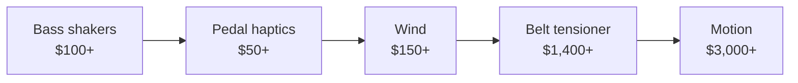

# Motion & Immersion

<small>Photo: [dronepicr](https://commons.wikimedia.org/wiki/File:Rennsimulator_Playseat_Gamescom_(36851094225).jpg), CC BY 2.0, cropped</small>

!!! info "NEW PAGE"
    Added by Claude on 2026-10-09. Not in the original site plan. Keep, edit or delete.

- What: add-ons that make you feel the car. shakers, belts, wind, motion
- Why: immersion. not lap time
- When: last. after rig, pedals, wheelbase, screens

<!-- Draft for you to edit. Facts from research-v2/11, 12, 03 and 09 (sources there). r/simracing views from 12. Prices USD, checked 2026-10. -->
<!-- Image source: https://commons.wikimedia.org/wiki/File:Rennsimulator_Playseat_Gamescom_(36851094225).jpg (CC BY 2.0, dronepicr) -->

## Buy order

## Varieties

| Add-on | You feel | Price | Moves you? |
|---|---|---|---|
| Bass shakers | Engine, kerbs, shifts, wheel slip | $100 to $350 | No. Vibration only |
| Pedal haptics | ABS, lockup, wheelspin under your foot | $50 to $150 a pedal | No |
| Wind | Speed on your face. Also cooling in VR | $150 to $400 | No |
| Belt tensioner | Harness pulls tight under braking | $1,400 to $1,800 | Squeezes you |
| G-seat | Seat panels press into you in corners | ~$3,000 | Squeezes you |
| Seat mover | Seat tilts | $1,500 to $3,000 | Yes, 2DOF |
| Actuators under the rig | Whole rig tilts and lifts | $3,000 to $9,000 | Yes, 3DOF |
| Traction loss, 6DOF | Rear slides out, rig shifts sideways | $4,500+ | Yes, 4 to 6DOF |

- All of it is PC only. It runs on game telemetry
- Exception: a shaker fed from the audio output works on console

## Bass shakers

- A speaker-like puck bolted to the seat or pedal plate. Plays the car as vibration
- Not motion. Nothing moves, it buzzes and thumps
- Driven by SimHub through a small amp

| Level | Kit | Price | Notes |
|---|---|---|---|
| Starter | Dayton puck (TT25) + small amp | ~$50 to $80 | Weak. Pedal plate or a light seat |
| Default | Dayton BST-1 + amp (Fosi, Nobsound) + SimHub | ~$100 to $180 | Best value. $180 = two BST-1, amp, USB sound card, wire, SimHub (Reddit build) |
| Stronger | Dayton BST-300EX + bigger amp | $199 a pair + amp | Needs a rigid rig |
| Plug and play | ButtKicker Gamer Plus / Pro | $280 / $350 | Amp and clamp included |
| Four corners | 4 shakers + 4-channel amp | $415 to $1,300 | Left / right and front / rear effects. Diminishing returns |

- Best immersion per dollar in the hobby
- Works on an office chair or foldable too
- Mount on the seat, not the frame. Quieter, and you feel more
- Rubber feet under the rig. Vibration travels through floors
- First effects: RPM and gear shift. Then road bumps and kerbs
- Each effect at 10 to 20%. Too many at once feels like noise
- Four corners: you cannot tell the wheels apart. Still adds immersion
- Not for everyone: one owner returned BST-1s and kept pedal haptics
- Nobsound amps: cheap, opinions split

## Pedal haptics

- Small motor on the pedal. ABS and lockup on the brake, wheelspin on the throttle
- Useful, not just fun: you feel the lock before you see it
- Simagic P-HPR: $49 each plus power supply. Fits Simagic pedals, adapters exist for others
- Cheap route: a Dayton puck under the pedal plate. Weaker than real pedal haptics
- Active pedals (Simucube ActivePedal, Moza mBooster) do this and more. See [Pedals](pedals.md)

## Wind

- Fans on the rig. Speed follows the car's speed through SimHub
- Best in VR: cools your face. Some find it eases nausea
- DIY controller + PC fans: ~$75
- Ready kits, two fans: $190 to $430
- A desk fan does half the job for free
- Named on Reddit: SimRaceLab kit, DIY Noctua fans on a manual dial (works on console)
- Thin data: owners like it, nobody on r/simracing debates it

## Belt tensioner

- Motors pull the harness tight under braking, loosen on throttle
- Does what motion cannot: holds pressure for the whole braking zone
- r/simracing: buy it before motion. Owners with both say the belt adds more on its own
- Helps braking, not just immersion
- Qubic QS-BT1: $1,450 to $1,830. Silent
- DIY SimHub tensioner: under $1,000, noisy
- SimXperience G-Belt: ~$1,365
- Needs a bucket seat with harness slots and a 4 to 6 point harness

## Motion: the six directions

| Axis | Movement | Feels like |
|---|---|---|
| Pitch | Nose tilts up / down | Braking, acceleration |
| Roll | Tilts left / right | Cornering load |
| Heave | Whole rig up / down | Kerbs, bumps, crests |
| Yaw | Rear swings around | The back stepping out |
| Surge | Slides forward / back | Braking, acceleration, without tilting |
| Sway | Slides left / right | Cornering, without tilting |

- DOF = degrees of freedom = how many of these a platform does

## 3DOF vs 6DOF

| | 3DOF | 6DOF |
|---|---|---|
| Axes | Pitch, roll, heave | All six |
| Hardware | 4 actuators under the rig | Hexapod, or 3DOF plus sliding base (surge, sway, traction loss) |
| Price | $3,000 to $9,000 | $4,500 to $30,000+ (est) |
| Space | Rig footprint + a hand of clearance | Much more, in every direction |
| Slides | Hinted at through roll | Felt directly through yaw |
| Who | Home rigs. The normal choice | Pro simulators, training centers |

- In between
    - 2DOF: pitch + roll. Seat movers
    - 4DOF: 3DOF + rear traction loss (yaw). The useful middle step
- Yaw is the upgrade that matters for drift, rally, catching slides
- Surge and sway add little on their own
- No home platform holds a sustained g-force. Motion gives the first hit, then eases back
- More DOF is not automatically better. Most guides are written by sellers
- Owners on r/simracing: "it's awesome but for fun, it's not going to make you faster"
- DIY route: SFX100 actuators run from SimHub

## Motion levels

| Level | Examples | Price | Notes |
|---|---|---|---|
| Seat mover, 2DOF | DOF Reality M2 $1,499, Next Level Racing Motion V3 $2,999 | $1,500 to $3,000 | Only the seat moves. Wheel and pedals stay put, which feels odd to some |
| Affordable 3DOF | Moza HMA150 $2,999, DOF Reality H3 $2,999 | ~$3,000 | The 2026 change. Motion at half the old price |
| Premium 3DOF | D-BOX G5 $6,000 to $8,250, Qubic QS-210 / QS-220 (EUR 6,680 / 8,880) | $6,000 to $10,000 | Faster, quieter, proven. D-BOX is what F1 Arcade uses |
| 6DOF | eRacing Lab RS Ultimate ~$4,500 + rig, DOF Reality H6 $6,999, pro hexapods | $4,500 to $30,000+ (est) | Room-sized commitment. Sliding parts add noise |

## Moza HMA150

- Moza's first motion product. Released July 2026. First units delivered Oct 2026, EU preorders mid-November
- $2,999 for four actuators, controller built in
- 3DOF: pitch, roll, heave
- 150 mm travel, 300 mm/s, 350 kg payload
- Bolts under an aluminum profile rig. Rig and seat not included
- "AI Motion": makes motion from picture and sound in games without telemetry
- Early review notes: one failed internal cable, loud first power supplies (since revised), built-in vibration does not replace shakers
- First owners on r/moza: quiet for the driver, heard downstairs. Build quality good. Physically tiring
- Open questions: SimHub support, VR motion compensation in Moza's software
- First generation. Long-term reliability unknown

## What matters

- A rigid aluminum profile rig first. Motion on a flexy rig is wasted
- Speed and smoothness of the actuators, not travel
- Software: game support, ease of tuning
- Noise and what is below your floor
- Clearance for cables. They must not pinch as the rig moves
- VR on a moving rig needs motion compensation set up, or the view drifts

## Ignore

- Lap time claims. A static rig is more repeatable under braking
- Big travel numbers
- 6DOF for a home rig
- Motion before load cell pedals and a direct drive base
- Harness without a tensioner. Decoration

## By tier

- Tier 0 to 2: none. A desk fan
- Tier 3: one shaker under the seat
- Tier 4: shakers on seat and pedals, wind if in VR
- Tier 5: 3DOF motion, belt tensioner, shakers

## Used

- Shakers and amps: low risk. Nothing to wear out
- Actuators: listen for knocking. Controller, cables, brackets all present
- Ask if the motion software license transfers
- Avoid: undocumented DIY motion

## Related pages

- [Sound](audio.md)
- [Chassis & Mounts](chassis-mounts.md)
- [Seat](seating.md)
- [Displays](displays-vr.md)
- [Tier 5: Motion / Pro](../builds/tier-5-motion-pro.md)
