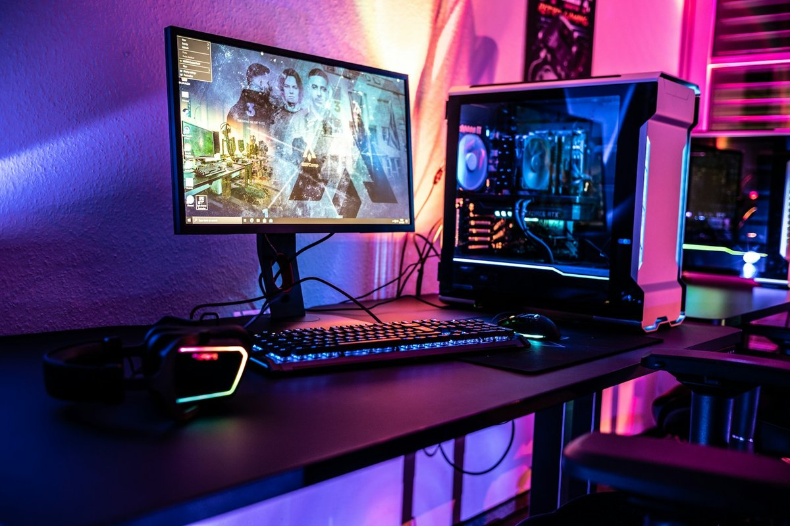

# PC / Console

<!-- Image source: https://unsplash.com/photos/a-desktop-computer-sitting-on-top-of-a-wooden-desk-Ie9BekWw_Uk (Unsplash license, ELLA DON) -->

- What: runs the sim
- Why: decides what you can play and how smooth
- When: first. then stop thinking about it

<!-- Draft for you to edit. Facts from research-v2/04, 06 and 10 (sources there). Prices USD, checked 2026-10. PC-per-display guidance is a synthesis, not benchmarks. -->

## Choices

| Platform | Price new | Good | Bad |
|---|---|---|---|
| PS5 | $600 to $650, refurb $499. Pro $900 | Gran Turismo 7, zero setup, PS VR2 | Fewest wheels work, costs more at every tier |
| Xbox Series S / X | $500 / $750 to $800 | Forza, Game Pass, Moza R3 works | Forza Motorsport no longer updated |
| PC, entry | ~$1,150 | Every sim, every wheel, all the free software | Setup and tinkering |
| PC, mid | ~$1,850 to $2,200 | Ultrawide, entry triples, Quest VR | Price |
| PC, high | ~$3,200 | Triple 1440p, high-res VR | Price |

- Own a console: use it. Buy a wheel that also works on PC (they all do)
- Buying new only for sim racing: a PC is the better buy in 2026. Consoles went up
- 2026: GPUs, RAM, consoles, VR headsets all cost more than older guides say

## PC levels

| Level | Parts class | Runs |
|---|---|---|
| Entry, ~$1,150 | Ryzen 5 + RX 9060 XT 16 GB or RTX 5060 | Single 1080p / 1440p |
| Mid, ~$2,000 | X3D CPU + RTX 5070 or RX 9070 XT | Ultrawide, triple 1080p, Quest VR |
| High, ~$3,200 | 9800X3D + RTX 5070 Ti to 5080 | Triple 1440p, high-res VR |

- Sims with big grids lean on the CPU. An X3D chip matters more than usual
- 12 to 16 GB of GPU memory for triples or VR. Not 8
- Under ~$2,000, prebuilts are often cheaper than building right now
- Older sims (Assetto Corsa, iRacing, RaceRoom) run on modest hardware

## What only PC can do

- iRacing, Le Mans Ultimate, Automobilista 2, BeamNG, AC EVO
- Mods (Assetto Corsa's whole appeal)
- Triples and ultrawide
- Mixed brands: any pedals, shifter, handbrake by USB
- SimHub, Crew Chief, bass shakers, motion

## Console wheel rules

- Console wheels need a licensed chip. A PC wheel will not "just work"
- PlayStation: the chip is in the wheelbase
- Xbox on Fanatec and Moza: the chip is in the wheel rim
- Other brands sell separate PlayStation and Xbox versions that look identical
- Pedals and shifters must plug into the same brand's base, not the console

| | PlayStation | Xbox |
|---|---|---|
| Logitech | G29, G923 PS, RS50 PS, PRO PS | G920, G923 Xbox, RS50 / PRO with Xbox hub |
| Thrustmaster | T248R, T300, T598 PS | T248, T598 Xbox |
| Fanatec | GT DD Pro, ClubSport DD+ | Any base with an Xbox wheel |
| Moza | No (announced Sept 2026, not on sale) | R3 Xbox bundle |
| Simagic, Simucube | No | No |

## Games by platform

| Game | PS5 | Xbox | PC |
|---|---|---|---|
| Gran Turismo 7 | Yes | No | No |
| Forza Motorsport | No | Yes | Yes |
| Forza Horizon 6 | Planned | Yes | Yes |
| F1 25 | Yes | Yes | Yes |
| Assetto Corsa Competizione | Yes | Yes | Yes |
| EA Sports WRC | Yes | Yes | Yes |
| iRacing | No | No | Yes |
| Le Mans Ultimate | 2027 | 2027 | Yes |
| Assetto Corsa EVO | Later | Later | Early Access |

## Ignore

- Waiting for the next GPU generation
- "Build it yourself, always cheaper." Not in 2026
- Adapters that promise any wheel on any console. Some work (Brook with a Moza R9 on PS5), with weak force feedback, and can break with updates
- "iRacing is on console." iRacing Arcade and NASCAR 25 are different games

## By tier

- Tier 0 to 2: whatever you own
- Tier 3: entry or mid PC, or console
- Tier 4: mid to high PC. Console stops here
- Tier 5: high PC

## Related pages

- [What to Play](../start/games.md)
- [Displays](displays-vr.md)
- [Wheelbase](wheelbases.md)
