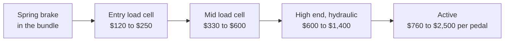

# Pedals

- What: throttle, brake, clutch
- Why: the brake is everything. load cell is the biggest single lap time gain
- When: right after a direct drive wheelbase. before everything else

<!-- Draft for you to edit. Facts from research-v2/02, 08 and 12 (sources there). Prices USD, checked 2026-10. Order (direct drive wheelbase, then load cell brake) is John's call. "Biggest lap time gain" is community consensus, not a measured fact. -->

## Levels

| Level | Examples | Price | Feels like | Buy if |
|---|---|---|---|---|
| Bundled, position sensor | Logitech G29 / G923, Moza SR-P Lite, Fanatec CSL, Thrustmaster T3PM | In the box, or $140 to $150 | Light, long travel. You brake by how far, not how hard | Starting out |
| Cheap fix | Moza brake kit $39, Fanatec Load Cell Kit $100, Logitech brake spring ~$25, TrueBrake mod ~$70 | $20 to $100 | Stiffer brake on the pedals you own | Delaying an upgrade |
| Entry load cell | Simjack UT ~$120, Simsonn Plus X ~EUR 170, Moza SRP2 $149, Simagic P500 $149, Logitech RS $160, Simagic P700 $189, Fanatec CSL LC $240, Thrustmaster T-LCM $250 | $120 to $250 | Firm, short travel. Brake by pressure | First upgrade. Works on floor or stand |
| Mid load cell, "buy once" | Moza CRP2 $369, Sim-Lab XP1 $399 to $499, Asetek La Prima $349 / Forte $479, Heusinkveld Sprint ~$585, Simagic P1000 $419 to $469, Fanatec CSL Elite V2 $330, ClubSport V3 $430 | $330 to $600 | All metal, very adjustable, brake you can lean on | Rigid rig owned. Most people stop here |
| High end | Simagic P2000 $619+, Fanatec Podium $600 to $700, Asetek Invicta ~$850, Heusinkveld Ultimate+ ~$1,400 | $600 to $1,400 | Damped, smooth, like a real brake pedal | Aluminum rig, already consistent |
| Active | Moza mBooster $759, Simucube ActivePedal Pro ~$1,850 + hub | $760 to $2,500 per pedal | A motor makes the feel. ABS pulse, changes per car | Everything else is sorted |

## Picks and warnings

- Budget picks on r/simracing: Simsonn Plus X, Simjack UT, Simnet SP Pro. AliExpress brands: cheap, good feel, slow warranty
- Reviewers' entry pick: Simagic P700
- Console: Fanatec CSL load cell. Good for the money, stiff. Softer springs fix it
- Thrustmaster T-LCM: dated. Fine used at ~EUR 100
- Heusinkveld Sprint: the long-time benchmark
- Simagic P1000: one long-term reviewer reports brake play and fading. Check recent reviews
- Moza CRP2: some call it poor value next to the Simagic P700 or Sim-Lab XP1
- Moza SR-P Lite (in the R3 / R5 bundles): soft spring brake. The first thing to replace
- Moza mBooster: owners split. Good brake, grainy throttle

## Sensor types

| Type | Reads | Notes |
|---|---|---|
| Potentiometer | Pedal position, by a rubbing contact | Wears, gets jumpy |
| Hall | Pedal position, by a magnet | Same feel, lasts |
| Load cell | Force on the pedal | The upgrade that matters |
| Hydraulic | Load cell or pressure sensor, with real fluid resistance | On cheap sets "hydraulic" means a small damper |
| Active | A motor creates the resistance | Not the same as vibration add-ons |

## Why a load cell

- Real brakes respond to pressure
- Your leg repeats a force far better than a foot position
- Gain: the same braking every lap. Consistency first, speed after
- Biggest for: braking at the limit without ABS, easing off while turning in
- Slower for the first week or two. Normal

## What matters

- Load cell brake
- A mount that does not move. Seat and pedals tied together
- Adjustable stiffness (rubber stacks or springs)
- Pedal spacing and angle that fit your feet
- Console: must be the same brand as the wheelbase

## Ignore

- 200 kg vs 100 kg sensors. Nobody brakes above 60 to 80 kg
- A clutch "just in case". Cheap to add later
- Vibration motors sold as "active"
- Active pedals, unless you change brake feel per car. A load cell plus pedal haptics gets most of the feel for a fraction of the money
- Setting it as stiff as it goes
- Inverted (hanging) pedals, unless you want road car feel and have the rig

## Two pedals or three

- Two is enough: F1, GT3, prototypes, most online racing
- Clutch needed: H-pattern shifter, drifting, trucks, some standing starts
- Add-on clutch: $45 to $100 on most sets

## Mounting

| Setup | Works | Does not |
|---|---|---|
| Desk, office chair, hard floor | Spring pedals, load cell set light (under ~25 kg) | Stiff brake: chair rolls, pedals lift |
| Carpet | Pedals with spikes or a heavy base | Light plastic bases |
| Against a wall | Simagic P500 (bracket included), Moza SRP2 (optional bracket) | |
| Wheel stand, foldable | Entry and mid load cells at moderate force | Flex starts ~25 to 30 kg |
| Aluminum rig | Everything | |

- Above ~30 to 40 kg of brake force: pedals and seat on the same frame

## Compatibility

- PC: any USB pedals with any wheel
- Console: pedals plug into the same brand's wheelbase. Never into the console
- Console load cells: Fanatec, Logitech, Thrustmaster only
- Moza pedals: PC, and Xbox only through an Xbox-capable Moza setup
- Simagic, Heusinkveld, Asetek, Simucube: PC only

## By tier

- Tier 0 to 1: bundled. First upgrade: an entry load cell
- Tier 2: entry load cell
- Tier 3 to 4: mid load cell
- Tier 5: active brake + good throttle

## Used

- Good used buy: little to wear out
- Test under hard braking. Cracked load cells and noisy sensors only show under load
- Check: controller box and cables included, rubber stacks present, brake reads smoothly to 100%
- Fair: roughly 55 to 70% of new (estimate)
- Seen paid: Fanatec CSL load cell EUR 100 to 120, ClubSport V3 EUR 200 to 250, Moza SRP load cell ~EUR 100

## Related pages

- [Chassis & Mounts](chassis-mounts.md)
- [Seat](seating.md)
- [Shifter & Handbrake](shifters-handbrakes.md)
- [First Setup](../start/first-setup.md)
