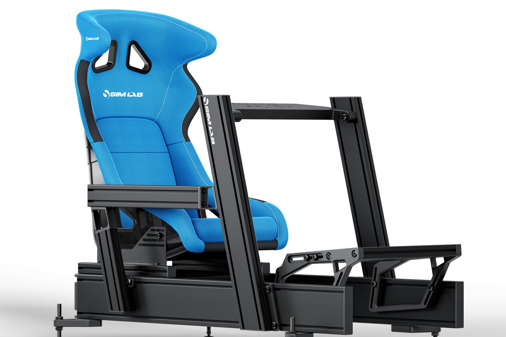

# Seat

<!-- Image source: https://sim-lab.us/products/p1x-pro-simracing-cockpit (Sim-Lab product image, cropped). File: https://sim-lab.us/cdn/shop/files/PX1_Pro_Wheeldeck_SLGT_Blue.jpg -->

- What: where you sit for hours
- Why: keeps you planted under braking, so your inputs stay consistent
- When: sessions get long, or you're sliding around in an office chair

<!-- Draft for you to edit. Facts from research-v2/03 and 09 (sources there). Prices USD, listings checked 2026-10-09. -->

## Varieties

| Type | Price | Good | Bad | For |
|---|---|---|---|---|
| Office chair | $0 | Already owned | Rolls, swivels, tilts | Desk and wheel stand only |
| Junkyard car seat | $50 to $75 | Most comfortable, slider and recline built in | Heavy, needs brackets or a drill | Anyone with a profile rig |
| Cheap bucket | ~$100 to $200 | Cheap, looks the part | Thin padding, sizing a gamble | Tight budget |
| Reclining sim seat | $250 to $390 | Adjustable, fits most bodies, easy in and out | Backrest gives slightly under hard braking | Most beginners, shared rigs |
| Fiberglass bucket | $350 to $450 | Zero flex, locked in | Size sensitive, less comfy long term | One driver who has test-sat it |
| Real motorsport bucket | $200 to $950 | The real thing | Narrow, built for a helmet and harness | Looks and feel |
| Formula seat | $600+ | Real open-wheel posture | Hard to get into, tiring | Formula-only drivers |

## What matters

- Fit: hips and shoulders. Try before buying a bucket
- No flex under hard braking
- Comfort over an hour
- A slider if more than one person drives
- How it mounts: side brackets or bottom rails
- Harness slots, if a belt tensioner is ever planned

## Ignore

- Racing brand logos
- Harnesses. Decoration, unless you add a belt tensioner
- "Buckets are better." Better hold, worse comfort and fit range

## Seating position

| Position | Posture | Use |
|---|---|---|
| GT | Upright, knees bent, pedals low | Everything, and VR. Start here |
| Formula | Hips low, feet near hip height, reclined | Only if you drive open-wheel almost always |

- Convertible rigs exist. Converting is tedious

## Junkyard seat tips

- Passenger seats have less wear
- Manual seats, not powered
- Keep the factory sliders
- Airbag seats: unplug it, never power that connector

## By tier

| Tier | Seat |
|---|---|
| 0 | Office chair with the wheels blocked |
| 1 | Built into the foldable |
| 2 | Comes with the cockpit |
| 3 to 4 | Recliner or junkyard seat |
| 5 | Bucket, sized for you |

## Used

- Check: foam, bolster wear, slider locks, mounting holes
- Real buckets have expiry dates for racing. Irrelevant for sim, good for price

## Where to buy

| Type | Product | Price | Buy |
|---|---|---|---|
| Reclining | NLR ERS3 Elite | $249 | [Next Level Racing][ers3] |
| Reclining | Trak Racer RE2 | $299, $369 with brackets | [Trak Racer][re2] |
| Reclining | GT Omega XL RS | $320 | [GT Omega][xlrs] |
| Reclining | GT Omega RS12 | $390 | [GT Omega][rs12] |
| Fiberglass bucket | Trak Racer GT Pro | $349, $399 with brackets | [Trak Racer][gtpro] |
| Fiberglass bucket | Sim-Lab S1 Sport GT | $449 | [Sim-Lab US][s1] |
| Motorsport bucket | Sparco | $200 to $950 | [Sparco USA][sparco] |
| Motorsport bucket | NRG | $200+ | [NRG][nrg] |
| Formula seat | Sparco F1-style sim seat | $600+ | [GPR Direct][f1seat] |
| Brackets | Trak Racer universal seat brackets | $69 | [Trak Racer][brk] |
| Brackets | NLR universal seat brackets | $79 | [Next Level Racing][brkn] |
| Slider | Trak Racer dual-lock slider | $49 | [Trak Racer][slider] |

- Prices checked 2026-10-09 at the maker's own US store. Shipping and tax extra
- Junkyard seats: your local pick-and-pull yard

## Related pages

- [Chassis & Mounts](chassis-mounts.md)
- [Pedals](pedals.md)
- [First Setup](../start/first-setup.md)

[ers3]: https://store-us.nextlevelracing.com/products/ers3-elite-reclining-seat
[re2]: https://trakracer.com/products/re2-recliner-sim-racing-seat-premium-diamond-stitched-leather-style-black
[xlrs]: https://www.gtomega.com/products/xl-rs-seat
[rs12]: https://www.gtomega.com/products/rs12-simulator-seat
[gtpro]: https://trakracer.com/products/gt-pro-racing-seat-fiberglass-black
[s1]: https://sim-lab.us/products/s1-sport
[sparco]: https://www.sparcousa.com/
[nrg]: https://getnrg.com/
[f1seat]: https://www.gprdirect.com/sparco-racing-seat-f1-sim-gaming/
[brk]: https://trakracer.com/products/universal-seat-brackets-for-recline-seats-and-office-chairs-2
[brkn]: https://store-us.nextlevelracing.com/products/next-level-racing-universal-seat-brackets
[slider]: https://trakracer.com/products/universal-dual-lock-seat-slider-kit-1
