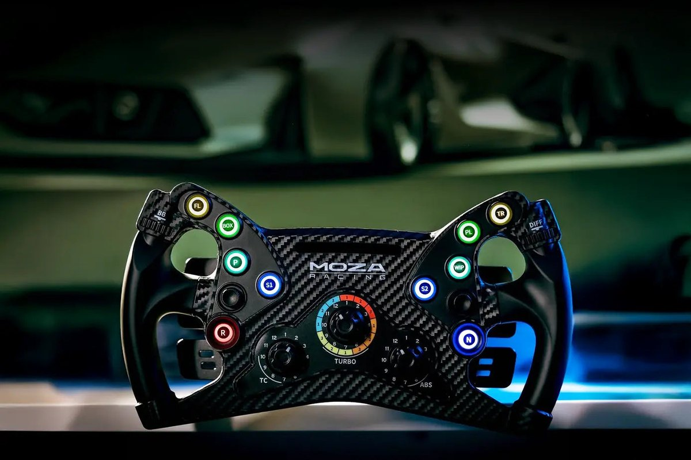

# Wheel

<!-- Image source: https://us.mozaracing.com/products/ks-gt-wheel (Moza product photo, cropped). File: https://us.mozaracing.com/cdn/shop/files/KS_Block2-2-update.webp -->

- What: the rim you hold. attaches to the wheelbase
- Why: shape and size change leverage and feel
- When: you specialize. one round wheel covers everything at first

<!-- Draft for you to edit. Facts from research-v2/01, 07 and 12 (sources there). Prices USD, listings checked 2026-10-09. Diameters are typical ranges, not checked per product. -->

## Shapes

| Shape | Size | Good for | Bad for |
|---|---|---|---|
| Round | 300 to 350 mm | Everything: road cars, rally, drift, trucks | Nothing. The default |
| D-shape / flat bottom | 300 to 330 mm | GT cars, general use | Drift (flat bottom snags) |
| GT "butterfly", open top | 290 to 320 mm | GT3, prototypes. Many buttons | Rally, drift |
| Formula, rectangular | 270 to 300 mm | F1, open wheel | Road cars, rally, drift, trucks |
| Rally / drift, deep dish | 320 to 350 mm | Rally, drift with a handbrake | Formula cars |

- A formula wheel looks the part. Buy a round or D-shape first: it works in every car
- Want one wheel that is not round: a 290 to 300 mm GT wheel is the middle ground. 270 mm formula wheels feel small to many
- H-pattern shifting is harder with a GT or formula wheel

## Levels

| Level | Price | Notes |
|---|---|---|
| Fixed to the base | Included | Logitech G29 / G923. Cannot swap |
| Bundle rims | $70 to $170 | Plastic, fine to learn on |
| Mid | $230 to $350 | Metal, better buttons and paddles. Where most stop |
| Premium brand rims | $330 to $800 | Leather or Alcantara, screens, clutch paddles |
| Boutique | $500 to $1,500+ | Real race-wheel build. For Simucube-class bases |
| Budget third-party | $60 to $200 | PC only, own USB cable, quality varies |

## What matters

- Shape that fits what you drive most
- Diameter: smaller feels stronger and quicker on the same base
- Weight: heavy rims dull a weak base. Keep big rims off 3 to 5 Nm
- Quick release that is solid and fast
- Paddle feel
- Console: the rim must be the same brand as the base

## Ignore

- Button count. A dozen is enough to start
- Built-in screens, at first
- Carbon fiber
- A second rim before load cell pedals

## When a second rim is worth it

- You settled into two clearly different things, e.g. F1 and rally
- Your base has a real quick release
- Pedals are already sorted

## Compatibility

| Brand | Quick release | Fits |
|---|---|---|
| Logitech G29 / G923 | None | Nothing swaps |
| Logitech RS / PRO | Own, on the RS hub | Logitech RS rims |
| Thrustmaster T300 and older | Screw collar | Old Thrustmaster rims. Slow to swap |
| Thrustmaster T598 / T818 | New | New rims, old ones with an adapter |
| Moza | Own ball-lock | Any current Moza rim on any current Moza base |
| Fanatec | QR2 | Fanatec only. QR1 and QR2 do not mix |
| Simagic | Own | Simagic rims |
| Simucube | Own | Big third-party scene. Simucube 2 rims need an adapter on Simucube 3 |

- PC: almost any USB rim can go on any base with an adapter and its own cable
- Console: same-brand licensed rims only
- Xbox support on Fanatec and Moza lives in the rim

## By tier

| Tier | Wheel |
|---|---|
| 0 to 1 | Whatever is in the bundle |
| 2 to 3 | One mid rim, round or GT |
| 4 | Add a second shape if you drive rally or drift |
| 5 | Boutique |

## Used

- Check: every button and paddle, quick release wear, grip condition
- Fanatec: confirm QR1 or QR2, and bent pins
- Rims hold value better than bases

## Where to buy

| Level | Product | Price | Buy |
|---|---|---|---|
| Bundle rim | Moza ESX, round, Xbox licensed | $129 | [Moza US][esx] |
| Bundle rim | Logitech RS round and GT rims | $70+ | [Logitech G][lrs] |
| Bundle rim | Fanatec CSL P1 | ~$100 to $170 | [Fanatec][fwheel] |
| Mid | Moza KS, GT shape | $229 | [Moza US][ks] |
| Mid | Moza CS V2P, round | $229 | [Moza US][cs] |
| Mid | Simagic GT Neo, GT shape | $239 | [Simagic][neo] |
| Mid | Fanatec CSL GT3 | $170 | [Fanatec][fwheel] |
| Premium | Moza KS Pro | $329 | [Moza US][kspro] |
| Premium | Moza CS Pro, round, screen | $329 | [Moza US][cspro] |
| Premium | Fanatec ClubSport and Podium rims | $330 to $800 | [Fanatec][fwheel] |
| Premium | Simucube Tahko Round, for Simucube 2 | $649 | [Trak Racer][tahko] |
| Boutique | Cube Controls | $500 to $1,500+ | [Cube Controls][cube] |
| Boutique | Ascher Racing | $500 to $1,500+ | [Ascher Racing][ascher] |
| Boutique | GSI (Gomez Sim Industries) | $700 to $1,500+ | [GSI][gsi] |
| Budget third-party | No-name USB rims | $60 to $200 | [AliExpress search][ali] |

- Prices checked 2026-10-09. Moza and Simagic from live store listings
- Moza sells base + wheel bundles for less than the parts. See [Wheelbase](wheelbases.md)

## Related pages

- [Wheelbase](wheelbases.md)
- [Shifter & Handbrake](shifters-handbrakes.md)
- [Button Box & Accessories](button-boxes-accessories.md)

[esx]: https://us.mozaracing.com/products/esx-steering-wheel
[lrs]: https://www.logitechg.com/en-us/shop/c/racing-wheels-pedals
[fwheel]: https://www.fanatec.com/us/en/c/steering-wheels
[ks]: https://us.mozaracing.com/products/ks-gt-wheel
[cs]: https://us.mozaracing.com/products/cs-v2p-wheel
[neo]: https://simagic.com/products/gt-neo
[kspro]: https://us.mozaracing.com/products/ks-pro-wheel
[cspro]: https://us.mozaracing.com/products/cs-pro-wheel
[tahko]: https://trakracer.com/products/simucube-tahko-round-black-edition
[cube]: https://cubecontrols.com/
[ascher]: https://www.ascher-racing.com/
[gsi]: https://gomezsimindustries.com/
[ali]: https://www.aliexpress.com/w/wholesale-sim-racing-steering-wheel.html
