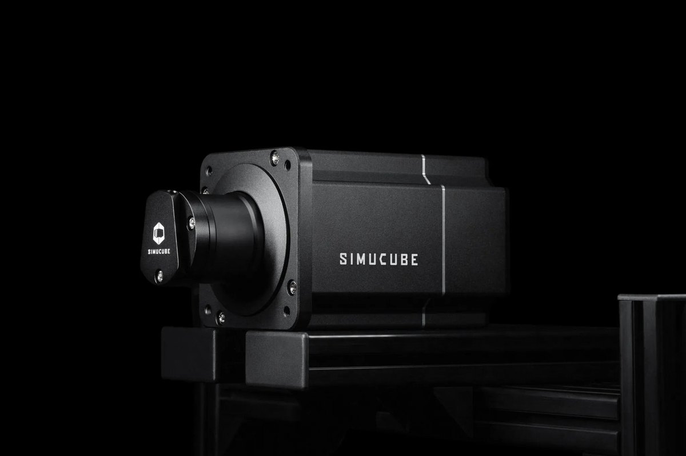
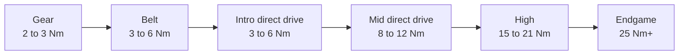

# Wheelbase

<!-- Image source: https://simucube.com/products/simucube-2-pro (Simucube product photo, cropped). File: https://simucube.com/cdn/shop/files/01_X4A0156-scaled.webp -->

- What: the motor behind the wheel. this is force feedback
- Why: the main thing you feel. how the car talks to you
- When: first. a direct drive bundle is the first buy. more torque can wait

<!-- Draft for you to edit. Facts from research-v2/01, 07, 11 and 12 (sources there). Prices USD, listings checked 2026-10-09. Picks and brand opinion are from r/simracing threads in research-v2/12. -->

## Levels

| Level | Price | Feels like | Buy if |
|---|---|---|---|
| Toy, no force feedback | Under $100 | A spring. Teaches nothing | Never. A gamepad is better |
| Gear drive, 2 to 3 Nm | ~$190 to $300 new, $100 to $150 used | Notchy, rattly, vague in the center. Less feel, not slower | Used, as a trial. PlayStation: fine new at ~$190 |
| Belt and hybrid, 3 to 6 Nm | $300 to $450 | Smoother, slightly muted | PlayStation on a tight budget, or used |
| Intro direct drive, 3 to 6 Nm | $280 to $600 in a bundle | Smooth, quiet, detailed. Light | First wheel bought new |
| Mid direct drive, 8 to 12 Nm | $300 to $520 base only | Real weight in fast corners. Headroom | Most people. The "forever" base |
| High, 15 to 21 Nm | $530 to $900 base only | Strong enough to hurt in a crash | Rigid rig already owned |
| Endgame, 25 Nm+ | $900 to $3,300 base only | Smoothest and fastest. Most owners run it at 30 to 60% | You know exactly why |

## Picks

| You | Pick |
|---|---|
| First direct drive, PC | Moza R5 Pro bundle, or R9 |
| PlayStation | Logitech RS50. Cheapest direct drive: Thrustmaster T598 |
| Xbox | Moza R3 Xbox bundle |
| Step up for feel | Simagic Alpha Evo |
| $100 to $150 trial | A used Logitech G29 / G920 |

## What matters

- Direct drive vs not: the biggest step. Nothing between motor and wheel, so no lost detail
- Torque: 5 to 8 Nm is plenty to start. 12 Nm is the sweet spot. 10 to 15 Nm covers nearly everyone
- More torque buys detail and headroom, not speed. Owners of 20 Nm+ bases run them at 8 to 13 Nm
- Small price gap between two bases: buy the stronger one and turn it down
- The brand's wheel lineup and prices. You are buying into it
- Console support on the exact model
- Mount: above ~8 Nm a desk or foldable flexes

## Ignore

- Torque above ~15 Nm. Headroom, not lap time
- Peak vs constant torque numbers across brands. Not comparable
- "Direct drive is dangerous." Not under ~10 Nm
- Vibration extras (Logitech TRUEFORCE, Fanatec FullForce). Nice, game dependent
- "Fanatec is dead." Owned by Corsair since 2024, new products, prices cut in 2026

## Brand notes

| Brand | Good | Watch out |
|---|---|---|
| Moza | Cheapest torque on PC, big lineup. The default first direct drive | Slow support. PlayStation bases (R5S Pro, R16S Ultra) announced Sept 2026, no price or date |
| Fanatec | Most wheels. Works on PlayStation and Xbox. The console default | Proprietary wheels. Software and firmware complaints. On PC most now pick Moza or Simagic |
| Simagic | Best-regarded feel for the money | PC only |
| Logitech | Easiest on console. One base covers PC + PS + Xbox with the right hub. Reliable | Adds up once pedals and hub are in |
| Thrustmaster | T598: cheapest PlayStation direct drive | Thin lineup, old belt wheels overpriced at list |
| Simucube | The reference. Huge third-party wheel scene | PC only, price |

## Compatibility

| Wheelbase | PC | PlayStation | Xbox |
|---|---|---|---|
| Logitech G29 / G923 PS, RS50 PS, PRO PS | Yes | Yes | RS50 / PRO with Xbox hub |
| Logitech G920 / G923 Xbox | Yes | No | Yes |
| Thrustmaster T248 PS, T300, T598 PS | Yes | Yes | No |
| Thrustmaster T248 Xbox, T598 Xbox | Yes | No | Yes |
| Fanatec GT DD Pro, ClubSport DD+ | Yes | Yes | With an Xbox wheel |
| Fanatec CSL DD, ClubSport DD, Podium DD | Yes | No | With an Xbox wheel |
| Moza R3 Xbox bundle | Yes | No | Yes |
| Moza R5 and up | Yes | No | Unclear. Moza's own pages disagree. Count on the R3 Xbox bundle only |
| Simagic, Simucube, Asetek, VRS | Yes | No | No |

- PlayStation support is in the base. It cannot be added later
- Moza on PS5 will need the new base. Existing Moza wheels and pedals are reported to work with it
- Every console wheel also works on PC

## By tier

| Tier | Wheelbase |
|---|---|
| 0 | Moza R3 / R5 bundle, or used G29 |
| 1 | Moza R5 / R5 Pro bundle. PlayStation: Logitech RS50, or T598 |
| 2 | Moza R9, Simagic Evo Sport. Console: Fanatec GT DD Pro 8 Nm, Logitech RS50 |
| 3 | Moza R12, Simagic Alpha Evo. Console: Fanatec ClubSport DD+, Logitech PRO |
| 4 | Same, or 18 to 21 Nm |
| 5 | Simucube 2 Pro or 3 Pro, Moza R25 Ultra |

## Used

- Best used buy: Logitech G29 / G920, $100 to $150
- Used direct drive: only if clearly under today's new price. New prices fell in 2026
- Seen paid: Moza R9 + load cell pedals EUR 350. Fanatec CSL DD 8 Nm + 2 wheels + pedals under GBP 750
- Fanatec: check QR1 vs QR2. Old QR1 does not fit current wheels
- Check: shaft play, connectors, firmware still updates
- Avoid: belt wheels near new direct drive money (T300 at $370+)
- Warranty usually stays with the first owner

## Where to buy

| Level | Product | Price | Buy |
|---|---|---|---|
| Gear drive | Logitech G29 / G920, with pedals | ~$190 to $300 | [Logitech G][g29], [Amazon][g29a] |
| Gear drive | Logitech G923, with pedals | $300 | [Logitech G][g923] |
| Belt and hybrid | Thrustmaster T248, with pedals | $300 to $330 | [Thrustmaster][t248] |
| Belt and hybrid | Thrustmaster T300 | $370 to $450 | [Thrustmaster][t300] |
| Intro direct drive | Moza R3 bundle, 3.9 Nm | $279 PC, $339 Xbox | [Moza US][r3], [Xbox version][r3x] |
| Intro direct drive | Moza R5 bundle, 5.5 Nm | $379 | [Moza US][r5] |
| Intro direct drive | Moza R5 Pro bundle, 6 Nm | $399 | [Moza US][r5pro] |
| Intro direct drive | Thrustmaster T598, 5 Nm, with pedals | $600 | [Thrustmaster][t598] |
| Intro direct drive | Fanatec CSL DD, 5 Nm | $400 base, $640 bundle | [Fanatec][fbase] |
| Mid direct drive | Moza R9 V3, 9 Nm | $299 | [Moza US][r9] |
| Mid direct drive | Moza R12 V2, 12 Nm | $399 | [Moza US][r12] |
| Mid direct drive | Simagic Alpha Evo Sport, 9 Nm | $399 | [Simagic][evo] |
| Mid direct drive | Simagic Alpha Evo, 12 Nm | $519 | [Simagic][evo] |
| Mid direct drive | Logitech RS50, 8 Nm | $350 to $450 base, $600 to $700 with wheel | [Logitech G][rs50] |
| Mid direct drive | Logitech PRO, 11 Nm, with wheel | $1,000 to $1,200 | [Logitech G][lpro] |
| Mid direct drive | Fanatec GT DD Pro, 8 Nm bundle | $860 | [Fanatec][gtdd] |
| High | Moza R16 Ultra, 16 Nm | $529 | [Moza US][r16] |
| High | Moza R21 Ultra, 21 Nm | $699 | [Moza US][r21] |
| High | Simagic Alpha Evo Pro, 18 Nm | $699 | [Simagic][evo] |
| High | Fanatec ClubSport DD / DD+ | $700 / $900 | [Fanatec][fbase] |
| High | VRS DirectForce Pro, 20 Nm | $799 | [VRS][vrs] |
| Endgame | Moza R25 Ultra, 25 Nm | $899 | [Moza US][r25] |
| Endgame | Simagic Alpha Evo Ultra, 28 Nm | $969 | [Simagic][evou] |
| Endgame | Fanatec Podium DD, 25 Nm | $1,200 | [Fanatec][pdd] |
| Endgame | Simucube 2 Pro, 25 Nm | $1,299 | [Trak Racer][sc2] |
| Endgame | Simucube 3 Pro, 25 Nm | $1,599 | [Trak Racer][sc3] |

- Prices checked 2026-10-09. Moza, Simagic and Simucube from live store listings. Fanatec, Logitech and Thrustmaster from their sites earlier the same day
- Moza sells base + wheel bundles for less than the parts: [R9 + KS wheel][r9ks] $509, [R12 + KS wheel][r12ks] $609
- G29: $189.98 at Amazon in a deal reported 2026-10-07

## Related pages

- [Wheel](wheel-rims.md)
- [Pedals](pedals.md)
- [Chassis & Mounts](chassis-mounts.md)
- [PC / Console](pc-console.md)
- [Buying Smart](../start/buying.md)

[g29]: https://www.logitechg.com/en-us/shop/p/driving-force-racing-wheel
[g29a]: https://www.amazon.com/dp/B00Z0UWWYC
[g923]: https://www.logitechg.com/en-us/shop/p/g923-trueforce-sim-racing-wheel
[t248]: https://www.thrustmaster.com/en-us/products/t248/
[t300]: https://eshop.thrustmaster.com/en_us/products-steering-wheels.html
[t598]: https://www.thrustmaster.com/en-us/products/t598/
[r3]: https://us.mozaracing.com/products/r3-racing-bundle-pc
[r3x]: https://us.mozaracing.com/products/r3-racing-bundle-xbox
[r5]: https://us.mozaracing.com/products/r5-racing-bundle
[r5pro]: https://us.mozaracing.com/products/r5-pro-bundle
[r9]: https://us.mozaracing.com/products/r9-wheelbase
[r12]: https://us.mozaracing.com/products/r12-wheelbase
[r16]: https://us.mozaracing.com/products/r16-ultra
[r21]: https://us.mozaracing.com/products/r21-ultra
[r25]: https://us.mozaracing.com/products/r25-ultra
[r9ks]: https://us.mozaracing.com/products/r9-ks-bundle
[r12ks]: https://us.mozaracing.com/products/r12-ks-bundle
[evo]: https://simagic.com/products/simagic-alpha-evo-wheel-base-9nm-12nm-18nm
[evou]: https://simagic.com/products/simagic-alpha-evo-ultra-28nm-direct-drive-wheel-base
[rs50]: https://www.logitechg.com/en-us/shop/p/rs50-system
[lpro]: https://www.logitechg.com/en-us/shop/p/pro-racing-wheel
[fbase]: https://www.fanatec.com/us/en/c/wheel-bases
[gtdd]: https://www.fanatec.com/us/en/p/sim-racing-bundles/crd-9020007-8nm-us/gran-turismo-dd-pro-8nm-qr2l-us
[pdd]: https://www.fanatec.com/us/en/p/wheel-bases/crd-9020022-us/podium-dd-us
[vrs]: https://vrs.racing/
[sc2]: https://trakracer.com/products/simucube-2-pro-direct-drive-wheel-base
[sc3]: https://trakracer.com/products/simucube-3-pro
