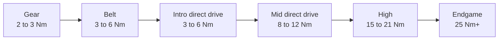

# Wheelbase

<!-- Image source: https://www.pexels.com/photo/sim-racing-setup-with-trueforce-steering-wheel-28993123/ (Pexels license, bertellifotografia). Logitech PRO direct drive base, cropped -->

- What: the motor behind the wheel. this is force feedback
- Why: the main thing you feel. how the car talks to you
- When: first. a direct drive bundle is the first buy. more torque can wait

<!-- Draft for you to edit. Facts from research-v2/01, 07, 11 and 12 (sources there). Prices USD, checked 2026-10. Picks and brand opinion are from r/simracing threads in research-v2/12. -->

## Levels

| Level | Examples | Price | Feels like | Buy if |
|---|---|---|---|---|
| Toy, no force feedback | Cheap no-name wheels | Under $100 | A spring. Teaches nothing | Never. A gamepad is better |
| Gear drive, 2 to 3 Nm | Logitech G29 / G920 / G923 | ~$200 new, $100 to $150 used | Notchy, rattly, vague in the center. Less feel, not slower | Used, as a trial. PlayStation: fine new at ~$180 |
| Belt and hybrid, 3 to 6 Nm | Thrustmaster T248, T300 | $300 to $450 | Smoother, slightly muted. T300 fades when hot | PlayStation on a tight budget, or used |
| Intro direct drive, 3 to 6 Nm | Moza R3, R5, R5 Pro. Fanatec CSL DD 5 Nm. Thrustmaster T598 | $260 to $600 in a bundle | Smooth, quiet, detailed. Light | First wheel bought new |
| Mid direct drive, 8 to 12 Nm | Moza R9, R12. Simagic Alpha Evo Sport / Evo. Logitech RS50. Fanatec CSL DD 8 Nm, GT DD Pro | $330 to $550 base only | Real weight in fast corners. Headroom | Most people. The "forever" base |
| High, 15 to 21 Nm | Moza R16 Ultra, R21 Ultra. Simagic Alpha Evo Pro. Fanatec ClubSport DD / DD+. VRS DirectForce Pro | $530 to $900 base only | Strong enough to hurt in a crash | Rigid rig already owned |
| Endgame, 25 Nm+ | Simucube 2 Pro, Simucube 3. Moza R25 Ultra. Simagic Alpha Evo Ultra. Fanatec Podium DD | $900 to $3,300 base only | Smoothest and fastest. Most owners run it at 30 to 60% | You know exactly why |

## Picks

- First direct drive, PC: Moza R5 Pro or R9
- PlayStation: Logitech RS50. Cheapest direct drive: Thrustmaster T598
- Xbox: Moza R3 Xbox bundle
- Step up for feel: Simagic Alpha Evo
- $100 to $150 trial: a used Logitech G29 / G920

## What matters

- Direct drive vs not: the biggest step. Nothing between motor and wheel, so no lost detail
- Torque: 5 to 8 Nm is plenty to start. 12 Nm is the sweet spot. 10 to 15 Nm covers nearly everyone
- More torque buys detail and headroom, not speed. Owners of 20 Nm+ bases run them at 8 to 13 Nm
- Small price gap between two bases: buy the stronger one and turn it down
- The brand's wheel lineup and prices. You are buying into it
- Console support on the exact model
- Mount: above ~8 Nm a desk or foldable flexes

## Ignore

- Torque above ~15 Nm. Headroom, not lap time
- Peak vs constant torque numbers across brands. Not comparable
- "Direct drive is dangerous." Not under ~10 Nm
- Vibration extras (Logitech TRUEFORCE, Fanatec FullForce). Nice, game dependent
- "Fanatec is dead." Owned by Corsair since 2024, new products, prices cut in 2026

## Brand notes

| Brand | Good | Watch out |
|---|---|---|
| Moza | Cheapest torque on PC, big lineup. The default first direct drive | Slow support. PlayStation bases (R5S Pro, R16S Ultra) announced Sept 2026, no price or date |
| Fanatec | Most wheels. Works on PlayStation and Xbox. The console default | Proprietary wheels. Software and firmware complaints. On PC most now pick Moza or Simagic |
| Simagic | Best-regarded feel for the money | PC only |
| Logitech | Easiest on console. One base covers PC + PS + Xbox with the right hub. Reliable | Adds up once pedals and hub are in |
| Thrustmaster | T598: cheapest PlayStation direct drive | Thin lineup, old belt wheels overpriced at list |
| Simucube | The reference. Huge third-party wheel scene | PC only, price |

## By tier

- Tier 0: Moza R3 / R5 bundle, or used G29
- Tier 1: Moza R5 / R5 Pro bundle. PlayStation: Logitech RS50, or T598
- Tier 2: Moza R9, Simagic Evo Sport. Console: Fanatec GT DD Pro 8 Nm, Logitech RS50
- Tier 3: Moza R12, Simagic Alpha Evo. Console: Fanatec ClubSport DD+, Logitech PRO
- Tier 4: same, or 18 to 21 Nm
- Tier 5: Simucube 3 Pro, Moza R25 Ultra

## Compatibility

| | PC | PlayStation | Xbox |
|---|---|---|---|
| Logitech G29 / G923 PS, RS50 PS, PRO PS | Yes | Yes | RS50 / PRO with Xbox hub |
| Logitech G920 / G923 Xbox | Yes | No | Yes |
| Thrustmaster T248R, T300, T598 PS | Yes | Yes | No |
| Thrustmaster T248, T598 Xbox | Yes | No | Yes |
| Fanatec GT DD Pro, ClubSport DD+ | Yes | Yes | With an Xbox wheel |
| Fanatec CSL DD, ClubSport DD, Podium DD | Yes | No | With an Xbox wheel |
| Moza R3 Xbox bundle | Yes | No | Yes |
| Moza R5 and up | Yes | No | Unclear. Moza's own pages disagree. Count on the R3 Xbox bundle only |
| Simagic, Simucube, Asetek, VRS | Yes | No | No |

- PlayStation support is in the base. It cannot be added later
- Moza on PS5 will need the new base. Existing Moza wheels and pedals are reported to work with it
- Every console wheel also works on PC

## Used

- Best used buy: Logitech G29 / G920, $100 to $150
- Used direct drive: only if clearly under today's new price. New prices fell in 2026
- Seen paid: Moza R9 + load cell pedals EUR 350. Fanatec CSL DD 8 Nm + 2 wheels + pedals under GBP 750
- Fanatec: check QR1 vs QR2. Old QR1 does not fit current wheels
- Check: shaft play, connectors, firmware still updates
- Avoid: belt wheels near new direct drive money (T300 at $370+)
- Warranty usually stays with the first owner

## Related pages

- [Wheel](wheel-rims.md)
- [Pedals](pedals.md)
- [Chassis & Mounts](chassis-mounts.md)
- [PC / Console](pc-console.md)
- [Buying Smart](../start/buying.md)
