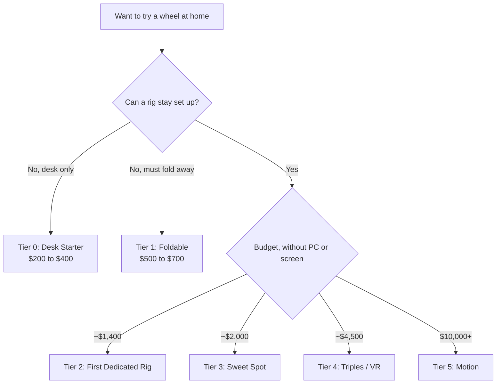

# Sim Racing Equipment Guide

<!-- Draft for you to edit. Facts from research-v2/ (sources there). Prices USD, checked 2026-10. -->

## Pick a setup

## Types of setups

| Tier | Cost | What it is |
|---|---|---|
| [0: Desk Starter](builds/tier-0-desk-starter.md) | $200 to $400 | Wheel clamped to your desk |
| [1: Foldable / Apartment](builds/tier-1-foldable-apartment.md) | $500 to $700 | Entry direct drive on a seat that folds into a closet |
| [2: First Dedicated Rig](builds/tier-2-first-dedicated-rig.md) | $1,200 to $1,600 | Fixed cockpit, 8 to 9 Nm, load cell brake |
| [3: Sweet Spot Enthusiast](builds/tier-3-sweet-spot-enthusiast.md) | $1,800 to $2,200 | Aluminum rig, 12 Nm, pedals you keep for 10 years |
| [4: Triples / VR Enthusiast](builds/tier-4-triples-vr-enthusiast.md) | $3,500 to $5,500 | Tier 3 plus wraparound screens or VR, shifter, shakers |
| [5: Motion / Pro](builds/tier-5-motion-pro.md) | $10,000 to $18,000 | The rig moves. What F1 Arcade has |

- Costs exclude PC or console, and the screen until Tier 4
- Side by side: [Types of Setups](builds/index.md)

## Words to know

| Word | Means |
|---|---|
| Wheelbase | The motor the steering wheel attaches to. It makes the force feedback |
| Direct drive | Wheel bolted straight to the motor. Smooth, quiet, detailed. The standard now |
| Nm | Wheelbase strength. 5 is light, 12 is plenty |
| Load cell | A brake pedal that reads how hard you press, not how far |
| Rig | The frame that holds seat, wheel and pedals |

- The rest: [Glossary](start/glossary.md)

## F1 Arcade vs home

| | F1 Arcade | Home |
|---|---|---|
| Motion | D-BOX actuators under a Vesaro rig | None until Tier 5 |
| Wheel and pedals | Mid-range | Same class or better from Tier 3 |
| Game | Custom rFactor 2, heavy driving assists | Any sim, fewer assists. Harder at first. Normal |
| Racing | Friends, short sprints | Any car, any track, ranked races against real people |
| Cost | ~$20 to $45 a visit, before food and drink | Hardware once, then games |

## Three decisions, in order

- Platform: PC, PlayStation or Xbox. It limits which wheels work before budget does
- Space: desk only, fold away, or permanent
- Budget: pick the tier

## Rules of thumb

- Spend order: direct drive wheelbase first, then a load cell brake, then everything else
- 5 to 8 Nm is plenty to start. 12 Nm is the sweet spot. 10 to 15 Nm covers nearly everyone
- Direct drive now starts at ~$260. Skip gear-driven wheels unless used
- Used Logitech G29 at ~$120 resells for ~$120: a free trial
- PlayStation is the expensive platform at every tier
- Motion and big torque add immersion, not lap time

## More

- [Getting Started: what to play](start/games.md)
- [Getting Started: first setup](start/first-setup.md)
- [Getting Started: buying smart](start/buying.md)
- [Components: Rig Anatomy](components/index.md)
- [Glossary](start/glossary.md)
