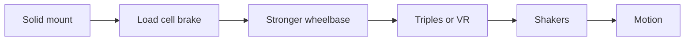

# Buying Smart

!!! info "NEW PAGE"
    Added by Claude on 2026-10-09. Not in the original site plan. Keep, edit or delete.

<!-- Facts from research-v2/05-tier-builds-used-market.md (sources there). Prices USD, checked 2026-10. Most used prices are estimates: check eBay sold listings. Reddit-reported prices from research-v2/12. -->

## Buy once vs throw away

| Buy once | Outgrown |
|---|---|
| Aluminum profile rig | Desk clamp |
| Load cell pedals | Foldable seat |
| The wheel brand you commit to | Steel tube cockpit |
| Seat | Gear or belt wheel |

## Upgrade order

- Change one thing at a time, or you cannot tell what helped

## You are buying a brand, not a wheel

- Wheels, quick releases and console support are locked to the brand
- PC: pedals, shifters, handbrakes from any brand plug in by USB
- Console: everything must plug into the same brand's wheelbase
- PlayStation support lives in the wheelbase. It cannot be added later
- Xbox support on Fanatec and Moza comes from the wheel rim
- Xbox and PlayStation versions look identical. Check the exact model before paying

## Costs people forget

| Extra | Typical |
|---|---|
| Sales tax | Up to 10% |
| Rig shipping | $100 to $250 from the EU |
| Seat, brackets, slider | $200 to $400. Most profile rigs ship without |
| Monitor mount | $100 single, $275 to $300 triple |
| Pedals, when a "system" has none | $130 to $160 |
| Console tax | Moza Xbox wheel $129, Logitech Xbox hub $150 to $190 |
| Shifter, handbrake | $130 to $170 each |
| Bolts, T-nuts, USB hub, cables, mat | $20 to $60 |
| GPU for triples or VR | $700 to $1,500 |
| iRacing | $125 a year plus content |

- A "$499 rig" is $900 to $1,100 sat in and driving

## Used market

- Where: Facebook Marketplace for rigs, monitors, Logitech sets. Sim racing buy/sell groups for enthusiast gear
- Maker refurb stores: Fanatec (2-year warranty), Logitech via eBay (1 year), Thrustmaster (6 months)
- Amazon "Used, Like New" for Logitech sets: returnable
- Best used buys: aluminum rigs, load cell pedals, Logitech G29/G920, monitors
- Patient buyers pay a little over half of new. Many listings ask more than new
- Paid on Reddit: G29 $100 to $150, Moza R9 + load cell pedals EUR 350, RTX 3090 EUR 500, PS VR2 EUR 150
- Supply: people who went all in and quit
- Risky used buys: direct drive bases priced near new. New prices fell in 2026
- Warranty rarely transfers (Fanatec and Thrustmaster say no). Price it as no warranty
- Before paying
    - Powers on and calibrates
    - Every pedal and button registers
    - Power supply, cables, quick release, clamp all present
    - Video of it working in a game if not buying in person
- Walk away from: shipping-only sellers with stock photos, gift card or friends-and-family payment, prices far under market

## When to buy

- Moza: everyday prices already match last Black Friday. Waiting saves little
- Fanatec, Thrustmaster: 20 to 35% off in late November. Waiting pays
- Logitech: discounted all year. Never pay list
- 2026 is a bad year for anything with memory in it: GPUs, RAM, consoles, VR headsets are up
- Monitors got cheaper

## Common regrets

- Buying endgame gear first. A 5 Nm base on a wheel stand lasts years
- Buying torque before pedals and a solid mount
- A foldable, then a 12 Nm base six months later
- A stiff load cell on a rolling office chair
- A wheel that does not work on your console
- A formula wheel first, because of F1 Arcade. Miserable in road cars
- Triples for F1 25 or Forza. They only stretch
- Motion before a rigid rig
- A Logitech G923 as an upgrade from a G29. Same thing
- A mid-priced steel tube cockpit, replaced a year later
- A clutch pedal that never gets used

## Related pages

- [Types of Setups](../builds/index.md)
- [Wheelbase](../components/wheelbases.md)
- [Pedals](../components/pedals.md)
- [Chassis & Mounts](../components/chassis-mounts.md)
