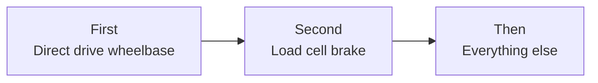

# Buying Smart

!!! info "NEW PAGE"
    Added by Claude on 2026-10-09. Not in the original site plan. Keep, edit or delete.

<!-- Facts from research-v2/05-tier-builds-used-market.md (sources there). Prices USD, checked 2026-10. Most used prices are estimates: check eBay sold listings. Reddit-reported prices from research-v2/12. -->

## Buy once vs outgrow

| Buy once | Outgrown |
|---|---|
| Aluminum profile rig | Desk clamp |
| Load cell pedals | Foldable seat |
| The wheel brand you commit to | Steel tube cockpit |
| Seat | Gear or belt wheel |

## Upgrade order

- Everything else, in the usual order: rigid rig, triples or VR, shakers, belt tensioner, motion
- Load cell before the rig: brake set light, chair blocked, pedals against a wall
- More torque comes last. 5 to 8 Nm lasts years
- Change one thing at a time, or you cannot tell what helped

## You are buying a brand, not a wheel

| Platform | Rule |
|---|---|
| Any | Wheels, quick releases and console support are locked to the brand |
| PC | Pedals, shifters, handbrakes from any brand plug in by USB |
| Console | Everything must plug into the same brand's wheelbase |
| PlayStation | Support lives in the wheelbase. It cannot be added later |
| Xbox | On Fanatec and Moza, support comes from the wheel rim |

- Xbox and PlayStation versions look identical. Check the exact model before paying

## Costs people forget

| Extra | Typical |
|---|---|
| Sales tax | Up to 10% |
| Rig shipping | $30 to $250 |
| Seat, brackets, slider | $250 to $450. Most profile rigs ship without |
| Monitor stand | $200 single, $300 to $360 triple |
| Pedals, when a "system" has none | $130 to $160 |
| Console tax | Moza Xbox wheel $129, Logitech Xbox hub $150 to $190 |
| Shifter, handbrake | $100 to $170 each |
| Bolts, T-nuts, USB hub, cables, mat | $20 to $60 |
| GPU for triples or VR | $700 to $1,500 |
| iRacing | $125 a year plus content |

- A "$499 rig" is $900 to $1,100 sat in and driving

## Used market

| Topic | What to know |
|---|---|
| Where | Facebook Marketplace for rigs, monitors, Logitech sets. Sim racing buy/sell groups for enthusiast gear |
| Refurb stores | Fanatec (2-year warranty), Logitech via eBay (1 year), Thrustmaster (6 months), Moza US |
| Returnable | Amazon "Used, Like New" for Logitech sets |
| Best buys | Aluminum rigs, load cell pedals, Logitech G29 / G920, monitors |
| Risky | Direct drive bases priced near new. New prices fell in 2026 |
| Fair price | Patient buyers pay a little over half of new. Many listings ask more than new |
| Supply | Barely used gear from people who went all in and quit |
| Seen paid | G29 $100 to $150, Moza R9 + load cell pedals EUR 350, PS VR2 EUR 150 |
| Warranty | Rarely transfers (Fanatec and Thrustmaster say no). Price it as no warranty |

- Before paying
    - Powers on and calibrates
    - Every pedal and button registers
    - Power supply, cables, quick release, clamp all present
    - Video of it working in a game if not buying in person
- Walk away from: shipping-only sellers with stock photos, gift card or friends-and-family payment, prices far under market

## When to buy

| Brand | Advice |
|---|---|
| Moza | Everyday prices already match last Black Friday. Waiting saves little. Bundles beat single parts |
| Fanatec, Thrustmaster | 20 to 35% off in late November. Waiting pays |
| Logitech | Discounted all year. Never pay list |
| GPUs, RAM, consoles, VR headsets | 2026 is a bad year for anything with memory in it. Prices are up |
| Monitors | Got cheaper |

## Common regrets

| Regret | Do this instead |
|---|---|
| Endgame gear first | A 5 Nm base on a wheel stand lasts years |
| More torque before a load cell brake | Brake first |
| A foldable, then a 12 Nm base six months later | A rigid rig before big torque |
| A load cell set stiff on a rolling office chair | Block the chair, set it light |
| A wheel that does not work on your console | Check the exact model |
| A formula wheel first | Round or D-shape first. Formula is miserable in road cars |
| Triples for F1 25 or Forza | They only stretch. Single or ultrawide |
| Motion before a rigid rig | Rig first |
| A Logitech G923 as an upgrade from a G29 | Same thing. Go direct drive |
| A mid-priced steel tube cockpit, replaced a year later | Aluminum profile, if the space exists |
| A clutch pedal that never gets used | Add it later, $45 to $100 |

## Related pages

- [Types of Setups](../builds/index.md)
- [Wheelbase](../components/wheelbases.md)
- [Pedals](../components/pedals.md)
- [Chassis & Mounts](../components/chassis-mounts.md)
