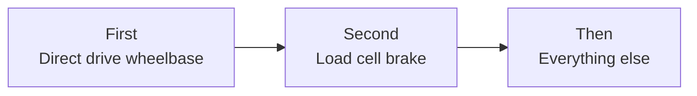

# Slow Start Guide

<!-- Starter draft from Claude, 2026-10-09, at your request. Yours to rewrite by hand. It mostly points at the other pages in a sensible order. -->

- For: you want to understand what you are buying before you buy it
- In a hurry: [Quick Start Guide](quick-start.md)

## 1. Try before you buy

- A used Logitech G29 / G920: $100 to $150, and it resells for the same
- Or a friend's rig, or a sim racing lounge
- Goal: find out if you like it. Any wheel will tell you

## 2. Answer three questions

| Question | Options | Read |
|---|---|---|
| Platform | PC, PlayStation, Xbox | [PC / Console](../components/pc-console.md) |
| Space | Desk only, fold away, permanent | [Types of Setups](../builds/index.md) |
| Budget | $200 to $18,000 | [Types of Setups](../builds/index.md) |

- Platform first. It limits which wheels work before budget does

## 3. Learn the words

| Word | Means |
|---|---|
| Wheelbase | The motor the steering wheel attaches to |
| Direct drive | Wheel bolted straight to the motor. The standard now |
| Nm | Wheelbase strength |
| Load cell | A brake that reads pressure, not travel |
| Rig | The frame that holds seat, wheel and pedals |

- All of them: [Glossary](glossary.md)
- Every part on a 3D rig: [Rig Anatomy](../components/index.md)

## 4. Pick a tier

- Six tiers, $200 to $18,000: [Types of Setups](../builds/index.md)
- Each tier page ends with an example build: parts, prices, links to buy
- Unsure between two: take the lower one. Parts carry up

## 5. Buy in this order

- Everything else, in the usual order: rigid rig, triples or VR, shakers, belt tensioner, motion
- One thing at a time, or you cannot tell what helped
- Used market, when to buy, common regrets: [Buying Smart](buying.md)

## 6. Read up on each part before you pay

| Part | Page |
|---|---|
| The motor | [Wheelbase](../components/wheelbases.md) |
| The brake | [Pedals](../components/pedals.md) |
| The frame | [Chassis & Mounts](../components/chassis-mounts.md) |
| The seat | [Seat](../components/seating.md) |
| The rim | [Wheel](../components/wheel-rims.md) |
| The screen | [Displays](../components/displays-vr.md) |
| Extras | [Shifter & Handbrake](../components/shifters-handbrakes.md), [Motion & Immersion](../components/immersion.md) |

- Each one has a "Where to buy" table at the bottom

## 7. Set it up properly

- Seating, field of view, force feedback, brake: [First Setup](first-setup.md)
- The two free wins: correct field of view, force feedback that does not clip

## 8. Learn to drive it

- One slow car, one track, for weeks
- Consistency first, speed later
- First ranked race: after 10 clean laps in a row
- Games, costs, online basics: [What to Play](games.md)
