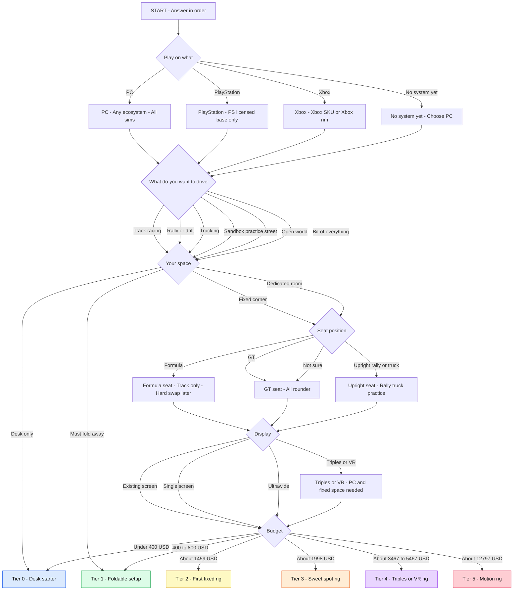
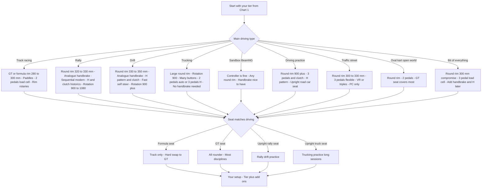

# Sim Racing Setup Decision Flowchart

Version: v2 — discipline add-ons and seating updated from the disciplines and seating research, 2026-10-02. Unverified items are marked as such and are not chart requirements.
Prices checked: 2026-10-02, US USD. Anchor totals copied from the research report — do not change one without changing the matching build table.

How to use: Answer in order. Platform is the first gate. Your lowest limit wins — desk space, fold-away space, console, or budget can cap the tier.

---

## Chart 1 — Choose your tier



Reading note: Desk only ends at Tier 0 and must fold away ends at Tier 1 by design. Fixed corner and dedicated room continue through seat, display and budget. Formula seat is a track-only choice and is hard to swap to GT later — seat angle, pedal height and angle, wheel height and screen height all move.

Seating consequences by discipline: track GT cars and mixed driving suit GT seat; rally, drift and driving practice suit upright rally style; trucking and practice long sessions suit upright truck style with a reclining seat.

---

## Chart 2 — Choose discipline add-ons

Confirmed gear per discipline from the disciplines research, 2026-10-02. Rim sizes are typical community ranges. Add-on prices are not included in the tier anchor totals.



Confirmed add-on anchors, verified live per the disciplines report, MOZA US store: HBP Handbrake $99, SGP Sequential Shifter $129, HGP H-pattern Shifter $149. Marketed switchable cockpits: Next Level Racing F-GT $599 verified live, F-GT Elite and ERS3 bundle $999 verified live — conversion between Formula and GT is still bolt work, not a lever flip.

Unverified nodes and notes only: AC Rally VR at v0.6 is unverified and is not shown as a chart requirement; BeamNG PS5 launch on 19 Oct 2026 is announced with no price, so Chart 1 treats BeamNG as PC today; ETS2 and ATS console versions have no date in Oct 2026.

---

## Same decision as plain text

```text
START
|
1. Play on what?
   - PC
     -> Any ecosystem. Only path for iRacing, triples, PC VR,
        BeamNG today, ETS2, ATS, No Hesi and mods.
     -> Go to 2.
   - PlayStation
     -> PS licensed wheelbase only.
     -> No PC-only brands. No iRacing. No triples. No mixed USB pedals.
     -> Go to 2, with that wheel limit.
   - Xbox
     -> Xbox SKU, or Xbox rim carries the licence. Check the suffix.
     -> No iRacing. No triples.
     -> Go to 2, with that wheel limit.
   - No system yet
     -> If sim racing is the main reason to buy, choose PC.
     -> Go to 2 as PC.
|
2. What do you want to drive?
   - Track racing / Rally / Drift / Trucking
   - Sandbox BeamNG / Driving practice / Traffic street
   - Oval, karting or open world / Bit of everything
   -> Remember this answer for Chart 2 add-ons.
   -> Go to 3.
|
3. Your space?
   - Desk only .................. END: Tier 0
   - Must fold away ............. END: Tier 1 (stay at 8 Nm or less)
   - Fixed corner ............... Go to 4.
   - Dedicated room ............. Go to 4. Tier 4 and Tier 5 possible.
|
4. Seat position?
   - Formula (track only, low and reclined, hard swap later)
   - GT (best all-rounder — pick this if not sure)
   - Upright rally (rally, drift, practice)
   - Upright truck (trucking, practice, long sessions)
   -> Seat is hard to swap later. Go to 5.
|
5. Display?
   - Existing screen / Single screen / Ultrawide -> Go to 6.
   - Triples or VR
     -> Needs PC + fixed space + strong PC. -> Go to 6.
|
6. Budget? (anchor totals, existing PC or console unless stated)
   - Under 400 USD .............. Tier 0 — $350
   - 400 to 800 USD ............. Tier 1 — $678
   - About 1459 USD ............. Tier 2 — $1,459
   - About 1998 USD ............. Tier 3 — $1,998
   - About 3467 to 5467 USD ..... Tier 4 — $5,467 new PC / $3,467 existing PC
   - About 12797 USD ............ Tier 5 — $12,797 with new PC
|
THEN Chart 2: add confirmed discipline parts (rim, clutch,
shifter, handbrake, buttons, rotation) to your tier.
```

---

## Decision table

Anchor total = the primary build total from the research report for that tier. T0 and T1 assume existing PC or console and existing display. T2 and T3 assume existing PC. Add-on prices from Chart 2 are separate and are not priced into the anchor.

| End result | Tier | Who it fits | Must-have gear | What to avoid | Anchor total |
|---|---|---|---|---|---|
| Desk starter, any first discipline | Tier 0 - Desk starter | Desk only, trying the hobby | Wheel and pedals bundle for your platform, desk clamp | Load cell pedals on carpet, PC-only wheel on console | $350 |
| Foldable apartment setup | Tier 1 - Foldable setup | Must fold away, first real seat position | Bundle plus Playseat Challenge class seat or wheel stand | Over 8 Nm base, strong load cell on a flexing seat | $678 |
| First fixed rig, track racing | Tier 2 - First fixed rig | Fixed corner, iRacing or ACC on PC, LMU on PC in Oct 2026 | Direct drive, load cell brake, GT or formula rim 280 to 300 mm, paddles, fixed profile rig, single screen | Formula seat if you will drive other disciplines, weak pedal tray | $1,459 |
| Fixed rig plus rally pack | Tier 2 - First fixed rig | Rally on a sensible budget | Tier 2 gear plus round rim 320 to 330 mm, analogue handbrake $99, sequential $129, H and clutch for historics | GT or formula rim for rally, button-only handbrake | $1,459 |
| Fixed rig plus drift pack | Tier 2 - First fixed rig | Drifting on PC | Round rim 330 to 350 mm, analogue handbrake, H pattern $149 and clutch, fast self steer base | Slow wheelbase, 2-pedal only setup | $1,459 |
| Sweet spot, bit of everything | Tier 3 - Sweet spot rig | Weekly racing, mixed disciplines | 12 Nm class direct drive, load cell, rigid rig, ultrawide, 300 mm round compromise rim | Buying more torque before display or pedals, Formula seat for mixed use | $1,998 |
| Sweet spot, trucking or street pack | Tier 3 - Sweet spot rig | ETS2 or ATS, BeamNG PC, No Hesi style street driving on PC | Tier 3 gear plus large round rim, 900 rotation, H pattern, clutch, many buttons | Small formula rim, 2-pedal only setup for H pattern cars, planning console for these games | $1,998 |
| Triples enthusiast | Tier 4 - Triples or VR rig | Dedicated PC sim space, leagues and endurance | Strong PC, heavy rig, three matched screens and stand | Triples on console, triples on a weak PC | $5,467 new PC/$3,467 existing |
| VR enthusiast | Tier 4 - Triples or VR rig | Wants depth and look to apex, small room footprint | Strong PC, heavy rig, PC VR headset, load cell | VR on console for PC sims, visible button box reliance | $5,467 new PC/$3,467 existing |
| Motion showpiece | Tier 5 - Motion rig | Dedicated room, closest to F1 Arcade motion at home | Motion ready heavy rig, high end base and pedals, belt or haptics, triples | Motion on an unplanned rig, used motion parts with no warranty | $12,797 |

---

## Hard-stop warnings

> **Read before you buy. These stop the chart, not slow it down.**
>
> - **Platform gate first.** PC is the only path for iRacing, triples, PC VR, Assetto Corsa mods, Le Mans Ultimate in Oct 2026, No Hesi style servers, and for buying ETS2, ATS, City Car Driving and BeamNG as PC sims today. Consoles lock both the games and the wheel.
> - **PlayStation:** the wheelbase must be PS licensed. For Fanatec the PS chip is in the base — a CSL DD can never work on PlayStation. Logitech and Thrustmaster sell separate PS SKUs. Moza, Simagic, Simucube and Asetek are PC-only in the builds research, with the single Xbox exception of the Moza R3 Xbox bundle — there is no PlayStation Moza on sale. The disciplines research adds that Moza announced its first PlayStation bases in Sep 2026 with no price revealed — do not plan a purchase on them. No iRacing, no triples, no mixed-brand USB pedals on PS5 — pedals must run through the base.
> - **Xbox:** the licence is in the Xbox SKU, or in the Xbox rim on Fanatec. Check the suffix on the box. Same game limits as PlayStation for iRacing and triples.
> - **No system yet:** if you are buying a system mainly for sim racing, buy a PC. A console first purchase can lock you out of the wheel and games you want later.
> - **Coming-soon games are not a platform plan.** BeamNG PS5 Early Access is announced for 19 Oct 2026 with no mods, no VR at launch and no announced price. ETS2 and ATS console versions are announced with no date in Oct 2026. LMU console is early to mid 2027. AC Rally is PC Steam Early Access since 13 Nov 2025, and its VR status at v0.6 is unverified.
> - **No load-cell pedals** on a desk setup, carpet, or an office chair. They push you backwards. Mount first, load cell second.
> - **No base over 8 Nm** on a foldable seat or light wheel stand. Flex eats the detail you paid for.
> - **Wrong rim trap:** a formula rim is wrong for rally, drift and trucking. Rally wants a round rim 320 to 330 mm, drift 330 to 350 mm, trucking a large round rim at 900 rotation.
> - **Seating trap:** Formula seating (low, reclined, legs up) does not quick-swap to GT or upright rally and truck seating. Seat angle, pedal height and angle, wheel height and screen height all move. Marketed Formula and GT cockpits still need bolt work to convert. Pick GT if you will do more than one type of driving.
> - **Triples and VR trap:** triples and PC VR need a PC, a fixed rig position, and a strong graphics card. They do not work from a console.
> - **Price trap:** anchor totals assume the PC, console and display state in the table note. A new PC is the hidden cost in Tier 4 and Tier 5.

---

## Sources and assumptions

- Tier anchors, compatibility traps and totals: builds research report dated 2026-10-02, `sim-racing-builds-2026-20261002-2025/report.md` Parts A and B.
- Discipline gear, seating geometry, switchable cockpits and traps: disciplines research report dated 2026-10-02, `sim-racing-disciplines-seating-20261002-2035/report.md` Sections 1 to 8, A, B, C and D.
- Verified live on 2026-10-02 in those reports: Moza US bundles and Logitech G Pro in the builds report; MOZA HBP $99, SGP $129 and HGP $149, Next Level Racing F-GT $599 and F-GT Elite and ERS3 bundle $999 in the disciplines report. Other prices are manufacturer or retailer index listings — re-check before buying.
- Unverified items kept out of chart requirements: AC Rally VR at v0.6, CarX Drift Racing Online 2 status, ETS2 and ATS console date, BeamNG PS5 price, CCD 2.0 wheel quality, Playseat US pricing, practice-sim efficacy.
